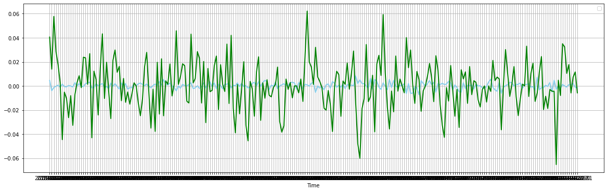

# 1. Собрать данные по дневным ценам активов (акций) и дневным объемам продаж на заданном фондовом рынке за указанный период. Добавить (если нет) данные по индексу рынка.


```python
import pandas as pd
import yfinance as yf
from yahoofinancials import YahooFinancials
```

**Скачал список компаний Франкфуртской биржи**


```python
companies_list_file_name = 'list.xlsx'
```


```python
companies_list = pd.read_excel(companies_list_file_name)
companies_list
```


<div>
<style scoped>
    .dataframe tbody tr th:only-of-type {
        vertical-align: middle;
    }

    .dataframe tbody tr th {
        vertical-align: top;
    }

    .dataframe thead th {
        text-align: right;
    }
</style>
<table border="1" class="dataframe">
  <thead>
    <tr style="text-align: right;">
      <th></th>
      <th>ISIN</th>
      <th>Ticker</th>
      <th>Company</th>
      <th>Sector</th>
      <th>Subsector</th>
      <th>Country</th>
      <th>Instrument Exchange</th>
    </tr>
  </thead>
  <tbody>
    <tr>
      <th>0</th>
      <td>LU2356314745</td>
      <td>NVM</td>
      <td>Novem Group S.A.</td>
      <td>Automobile</td>
      <td>Auto Parts &amp; Equipment</td>
      <td>Luxembourg</td>
      <td>XETRA + FRANKFURT</td>
    </tr>
    <tr>
      <th>1</th>
      <td>DE0005545503</td>
      <td>1U1</td>
      <td>1&amp;1 AG</td>
      <td>Telecommunication</td>
      <td>Wireless Communication</td>
      <td>Germany</td>
      <td>XETRA + FRANKFURT</td>
    </tr>
    <tr>
      <th>2</th>
      <td>DE000A3CNK42</td>
      <td>YOU</td>
      <td>ABOUT YOU Holding AG</td>
      <td>Retail</td>
      <td>Retail, Internet</td>
      <td>Germany</td>
      <td>XETRA + FRANKFURT</td>
    </tr>
    <tr>
      <th>3</th>
      <td>DE000A3CQ7F4</td>
      <td>BIKE</td>
      <td>Bike24 Holding AG</td>
      <td>Retail</td>
      <td>Retail, Internet</td>
      <td>Germany</td>
      <td>XETRA + FRANKFURT</td>
    </tr>
    <tr>
      <th>4</th>
      <td>DE000A3CRRN9</td>
      <td>C3RY</td>
      <td>Cherry AG</td>
      <td>Technology</td>
      <td>Electronic Components &amp; Hardware</td>
      <td>Germany</td>
      <td>XETRA + FRANKFURT</td>
    </tr>
    <tr>
      <th>...</th>
      <td>...</td>
      <td>...</td>
      <td>...</td>
      <td>...</td>
      <td>...</td>
      <td>...</td>
      <td>...</td>
    </tr>
    <tr>
      <th>491</th>
      <td>DE000A1RFMY4</td>
      <td>RCMN</td>
      <td>RCM BETEILIGUNGS NA. O.N.</td>
      <td>Financial Services</td>
      <td>Real Estate</td>
      <td>Germany</td>
      <td>XETRA + FRANKFURT</td>
    </tr>
    <tr>
      <th>492</th>
      <td>DE0006942808</td>
      <td>PZS</td>
      <td>SCHERZER U. CO. AG O.N.</td>
      <td>Financial Services</td>
      <td>Private Equity &amp; Venture Capital</td>
      <td>Germany</td>
      <td>XETRA + FRANKFURT</td>
    </tr>
    <tr>
      <th>493</th>
      <td>DE000A1MMEV4</td>
      <td>SGF</td>
      <td>SGT GERMAN PRIVATE EQUITY GMBH &amp; CO KGAA</td>
      <td>Software</td>
      <td>Internet</td>
      <td>Germany</td>
      <td>XETRA + FRANKFURT</td>
    </tr>
    <tr>
      <th>494</th>
      <td>DE000A161NR7</td>
      <td>N4G</td>
      <td>THE NAGA GROUP AG NA O.N.</td>
      <td>Financial Services</td>
      <td>Securities Brokers</td>
      <td>Germany</td>
      <td>XETRA + FRANKFURT</td>
    </tr>
    <tr>
      <th>495</th>
      <td>DE000A0KEXC7</td>
      <td>V3S</td>
      <td>VECTRON SYSTEMS      O.N.</td>
      <td>Industrial</td>
      <td>Advanced Industrial Equipment</td>
      <td>Germany</td>
      <td>XETRA + FRANKFURT</td>
    </tr>
  </tbody>
</table>
<p>496 rows × 7 columns</p>
</div>


```python
start_date = '2019-01-02'
end_date = '2020-01-01'

def download_ticker(ticker, start=start_date, end=end_date):
    return yf.download(ticker, start, end)
```

**Индекс DAX представляет собой главный индекс Франфуртской биржи.  Индекс вычисляется как среднее взвешенное по капитализации значение цен акций крупнейших акционерных компаний Германии (при этом капитализация рассчитывается лишь на основе акций, находящихся в свободном обращении). Индекс учитывает также полученные в виде дивидендов доходы по акциям, предполагая, что дивиденды реинвестируются в акцию, по которой был получен данный дивиденд. Таким образом, индекс отражает суммарный доход по капиталу.**


```python
DAX_index = download_ticker('^GDAXI')
DAX_index.drop(['Open', 'High', 'Low', 'Close'], axis=1, inplace=True)
DAX_index
```

    [*********************100%***********************]  1 of 1 completed


<div>
<style scoped>
    .dataframe tbody tr th:only-of-type {
        vertical-align: middle;
    }

    .dataframe tbody tr th {
        vertical-align: top;
    }

    .dataframe thead th {
        text-align: right;
    }
</style>
<table border="1" class="dataframe">
  <thead>
    <tr style="text-align: right;">
      <th></th>
      <th>Adj Close</th>
      <th>Volume</th>
    </tr>
    <tr>
      <th>Date</th>
      <th></th>
      <th></th>
    </tr>
  </thead>
  <tbody>
    <tr>
      <th>2019-01-02</th>
      <td>10580.190430</td>
      <td>79626700</td>
    </tr>
    <tr>
      <th>2019-01-03</th>
      <td>10416.660156</td>
      <td>84733800</td>
    </tr>
    <tr>
      <th>2019-01-04</th>
      <td>10767.690430</td>
      <td>95339500</td>
    </tr>
    <tr>
      <th>2019-01-07</th>
      <td>10747.809570</td>
      <td>71151400</td>
    </tr>
    <tr>
      <th>2019-01-08</th>
      <td>10803.980469</td>
      <td>93672200</td>
    </tr>
    <tr>
      <th>...</th>
      <td>...</td>
      <td>...</td>
    </tr>
    <tr>
      <th>2019-12-19</th>
      <td>13211.959961</td>
      <td>84018200</td>
    </tr>
    <tr>
      <th>2019-12-20</th>
      <td>13318.900391</td>
      <td>170723200</td>
    </tr>
    <tr>
      <th>2019-12-23</th>
      <td>13300.980469</td>
      <td>56215400</td>
    </tr>
    <tr>
      <th>2019-12-27</th>
      <td>13337.110352</td>
      <td>43758600</td>
    </tr>
    <tr>
      <th>2019-12-30</th>
      <td>13249.009766</td>
      <td>31427400</td>
    </tr>
  </tbody>
</table>
<p>251 rows × 2 columns</p>
</div>


**Выкачал тикеры, удалил из датафрейма компании которые не скачались. Перекачивать не нужно, сохранено в бинарник.**


```python
tickers = [None] # None для нормальной адресации - в фрейме с компаниями индексация начинается с единицы
failed = []
for index, row in companies_list.iterrows():
    ticker = str(row['Ticker'])
    ticker_data = download_ticker(ticker)
    if ticker_data.shape[0] == 0:
        failed.append(index)
        continue
    tickers.append(ticker_data)
companies_list = companies_list.drop(failed)
companies_list
```

    [*********************100%***********************]  1 of 1 completed
    
    1 Failed download:
    - NVM: No data found for this date range, symbol may be delisted
    [*********************100%***********************]  1 of 1 completed
    
    1 Failed download:
    - 1U1: No data found, symbol may be delisted
    [*********************100%***********************]  1 of 1 completed
    
    1 Failed download:
    - YOU: Data doesn't exist for startDate = 1546376400, endDate = 1577826000
    [*********************100%***********************]  1 of 1 completed
    
    1 Failed download:
    - BIKE: No data found for this date range, symbol may be delisted
    [*********************100%***********************]  1 of 1 completed
    
    1 Failed download:
    - C3RY: No data found, symbol may be delisted
    [*********************100%***********************]  1 of 1 completed
    [*********************100%***********************]  1 of 1 completed
    
    1 Failed download:
    - 2INV: No data found, symbol may be delisted
    [*********************100%***********************]  1 of 1 completed
    [*********************100%***********************]  1 of 1 completed
    [*********************100%***********************]  1 of 1 completed
    [*********************100%***********************]  1 of 1 completed
    
    1 Failed download:
    - A4Y: No data found, symbol may be delisted
    [*********************100%***********************]  1 of 1 completed
    [*********************100%***********************]  1 of 1 completed
    [*********************100%***********************]  1 of 1 completed
    
    1 Failed download:
    - ADJ: Data doesn't exist for startDate = 1546376400, endDate = 1577826000
    [*********************100%***********************]  1 of 1 completed
    
    1 Failed download:
    - ADL: No data found for this date range, symbol may be delisted
    [*********************100%***********************]  1 of 1 completed
    
    1 Failed download:
    - ADV: Data doesn't exist for startDate = 1546376400, endDate = 1577826000
    [*********************100%***********************]  1 of 1 completed
    
    1 Failed download:
    - AAH: No data found for this date range, symbol may be delisted
    [*********************100%***********************]  1 of 1 completed
    [*********************100%***********************]  1 of 1 completed
    
    1 Failed download:
    - AIXA: No data found, symbol may be delisted
    [*********************100%***********************]  1 of 1 completed
    
    1 Failed download:
    - ASL: No data found for this date range, symbol may be delisted
    [*********************100%***********************]  1 of 1 completed
    
    1 Failed download:
    - A1OS: No data found, symbol may be delisted
    [*********************100%***********************]  1 of 1 completed
    [*********************100%***********************]  1 of 1 completed
    [*********************100%***********************]  1 of 1 completed
    
    1 Failed download:
    - ACT: Data doesn't exist for startDate = 1546376400, endDate = 1577826000
    [*********************100%***********************]  1 of 1 completed
    
    1 Failed download:
    - AAD: No data found for this date range, symbol may be delisted
    [*********************100%***********************]  1 of 1 completed
    
    1 Failed download:
    - AT1: No data found, symbol may be delisted
    [*********************100%***********************]  1 of 1 completed
    [*********************100%***********************]  1 of 1 completed
    
    1 Failed download:
    - AOF: No data found for this date range, symbol may be delisted
    [*********************100%***********************]  1 of 1 completed
    [*********************100%***********************]  1 of 1 completed
    
    1 Failed download:
    - NDA: No data found for this date range, symbol may be delisted
    [*********************100%***********************]  1 of 1 completed
    
    1 Failed download:
    - AG1: No data found, symbol may be delisted
    [*********************100%***********************]  1 of 1 completed
    
    1 Failed download:
    - AVES: No data found, symbol may be delisted
    [*********************100%***********************]  1 of 1 completed
    
    1 Failed download:
    - BAS: No data found, symbol may be delisted
    [*********************100%***********************]  1 of 1 completed
    [*********************100%***********************]  1 of 1 completed
    [*********************100%***********************]  1 of 1 completed
    
    1 Failed download:
    - B5A: No data found, symbol may be delisted
    [*********************100%***********************]  1 of 1 completed
    
    1 Failed download:
    - BMW3: No data found, symbol may be delisted
    [*********************100%***********************]  1 of 1 completed
    [*********************100%***********************]  1 of 1 completed
    
    1 Failed download:
    - BAYN: No data found, symbol may be delisted
    [*********************100%***********************]  1 of 1 completed
    
    1 Failed download:
    - BYW: No data found for this date range, symbol may be delisted
    [*********************100%***********************]  1 of 1 completed
    
    1 Failed download:
    - BYW6: No data found, symbol may be delisted
    [*********************100%***********************]  1 of 1 completed
    
    1 Failed download:
    - BBZA: No data found, symbol may be delisted
    [*********************100%***********************]  1 of 1 completed
    
    1 Failed download:
    - BC8: No data found, symbol may be delisted
    [*********************100%***********************]  1 of 1 completed
    
    1 Failed download:
    - BFSA: No data found, symbol may be delisted
    [*********************100%***********************]  1 of 1 completed
    
    1 Failed download:
    - BEI: No data found for this date range, symbol may be delisted
    [*********************100%***********************]  1 of 1 completed
    
    1 Failed download:
    - BDT: No data found for this date range, symbol may be delisted
    [*********************100%***********************]  1 of 1 completed
    
    1 Failed download:
    - ACX: No data found for this date range, symbol may be delisted
    [*********************100%***********************]  1 of 1 completed
    [*********************100%***********************]  1 of 1 completed
    
    1 Failed download:
    - B8F: No data found, symbol may be delisted
    [*********************100%***********************]  1 of 1 completed
    [*********************100%***********************]  1 of 1 completed
    
    1 Failed download:
    - BIO3: No data found, symbol may be delisted
    [*********************100%***********************]  1 of 1 completed
    [*********************100%***********************]  1 of 1 completed
    
    1 Failed download:
    - BNN: No data found for this date range, symbol may be delisted
    [*********************100%***********************]  1 of 1 completed
    
    1 Failed download:
    - BNR: Data doesn't exist for startDate = 1546376400, endDate = 1577826000
    [*********************100%***********************]  1 of 1 completed
    
    1 Failed download:
    - BKHT: No data found, symbol may be delisted
    [*********************100%***********************]  1 of 1 completed
    
    1 Failed download:
    - COK: No data found for this date range, symbol may be delisted
    [*********************100%***********************]  1 of 1 completed
    
    1 Failed download:
    - CPX: No data found for this date range, symbol may be delisted
    [*********************100%***********************]  1 of 1 completed
    
    1 Failed download:
    - AFX: No data found for this date range, symbol may be delisted
    [*********************100%***********************]  1 of 1 completed
    
    1 Failed download:
    - CEC: No data found for this date range, symbol may be delisted
    [*********************100%***********************]  1 of 1 completed
    
    1 Failed download:
    - CEC1: No data found, symbol may be delisted
    [*********************100%***********************]  1 of 1 completed
    
    1 Failed download:
    - CSH: No data found for this date range, symbol may be delisted
    [*********************100%***********************]  1 of 1 completed
    
    1 Failed download:
    - CWC: No data found for this date range, symbol may be delisted
    [*********************100%***********************]  1 of 1 completed
    
    1 Failed download:
    - C0M: No data found, symbol may be delisted
    [*********************100%***********************]  1 of 1 completed
    
    1 Failed download:
    - CBK: No data found, symbol may be delisted
    [*********************100%***********************]  1 of 1 completed
    [*********************100%***********************]  1 of 1 completed
    [*********************100%***********************]  1 of 1 completed
    
    1 Failed download:
    - CCAP: Data doesn't exist for startDate = 1546376400, endDate = 1577826000
    [*********************100%***********************]  1 of 1 completed
    
    1 Failed download:
    - 1COV: No data found, symbol may be delisted
    [*********************100%***********************]  1 of 1 completed
    [*********************100%***********************]  1 of 1 completed
    
    1 Failed download:
    - CE2: No data found, symbol may be delisted
    [*********************100%***********************]  1 of 1 completed
    
    1 Failed download:
    - EVD: No data found for this date range, symbol may be delisted
    [*********************100%***********************]  1 of 1 completed
    
    1 Failed download:
    - DAI: No data found for this date range, symbol may be delisted
    [*********************100%***********************]  1 of 1 completed
    
    1 Failed download:
    - DAM: No data found for this date range, symbol may be delisted
    [*********************100%***********************]  1 of 1 completed
    
    1 Failed download:
    - DHER: No data found, symbol may be delisted
    [*********************100%***********************]  1 of 1 completed
    [*********************100%***********************]  1 of 1 completed
    [*********************100%***********************]  1 of 1 completed
    [*********************100%***********************]  1 of 1 completed
    
    1 Failed download:
    - DBK: No data found for this date range, symbol may be delisted
    [*********************100%***********************]  1 of 1 completed
    
    1 Failed download:
    - DB1: No data found, symbol may be delisted
    [*********************100%***********************]  1 of 1 completed
    
    1 Failed download:
    - DEQ: No data found for this date range, symbol may be delisted
    [*********************100%***********************]  1 of 1 completed
    [*********************100%***********************]  1 of 1 completed
    
    1 Failed download:
    - DWNI: No data found, symbol may be delisted
    [*********************100%***********************]  1 of 1 completed
    
    1 Failed download:
    - DEZ: No data found for this date range, symbol may be delisted
    [*********************100%***********************]  1 of 1 completed
    
    1 Failed download:
    - DFV: No data found for this date range, symbol may be delisted
    [*********************100%***********************]  1 of 1 completed
    [*********************100%***********************]  1 of 1 completed
    [*********************100%***********************]  1 of 1 completed
    [*********************100%***********************]  1 of 1 completed
    
    1 Failed download:
    - HNL: No data found for this date range, symbol may be delisted
    [*********************100%***********************]  1 of 1 completed
    
    1 Failed download:
    - DRW8: No data found, symbol may be delisted
    [*********************100%***********************]  1 of 1 completed
    
    1 Failed download:
    - DRW3: No data found, symbol may be delisted
    [*********************100%***********************]  1 of 1 completed
    
    1 Failed download:
    - DBAN: No data found, symbol may be delisted
    [*********************100%***********************]  1 of 1 completed
    
    1 Failed download:
    - JB7: No data found, symbol may be delisted
    [*********************100%***********************]  1 of 1 completed
    
    1 Failed download:
    - DKG: No data found for this date range, symbol may be delisted
    [*********************100%***********************]  1 of 1 completed
    [*********************100%***********************]  1 of 1 completed
    [*********************100%***********************]  1 of 1 completed
    
    1 Failed download:
    - DUE: No data found for this date range, symbol may be delisted
    [*********************100%***********************]  1 of 1 completed
    
    1 Failed download:
    - DWS: No data found for this date range, symbol may be delisted
    [*********************100%***********************]  1 of 1 completed
    
    1 Failed download:
    - EOAN: No data found, symbol may be delisted
    [*********************100%***********************]  1 of 1 completed
    
    1 Failed download:
    - EUZ: No data found for this date range, symbol may be delisted
    [*********************100%***********************]  1 of 1 completed
    
    1 Failed download:
    - E4C: No data found, symbol may be delisted
    [*********************100%***********************]  1 of 1 completed
    
    1 Failed download:
    - ED4: No data found, symbol may be delisted
    [*********************100%***********************]  1 of 1 completed
    
    1 Failed download:
    - EIN3: No data found, symbol may be delisted
    [*********************100%***********************]  1 of 1 completed
    
    1 Failed download:
    - ELG: No data found for this date range, symbol may be delisted
    [*********************100%***********************]  1 of 1 completed
    
    1 Failed download:
    - ZIL2: No data found, symbol may be delisted
    [*********************100%***********************]  1 of 1 completed
    
    1 Failed download:
    - ELB: No data found, symbol may be delisted
    [*********************100%***********************]  1 of 1 completed
    
    1 Failed download:
    - CAP: Data doesn't exist for startDate = 1546376400, endDate = 1577826000
    [*********************100%***********************]  1 of 1 completed
    
    1 Failed download:
    - ECX: No data found for this date range, symbol may be delisted
    [*********************100%***********************]  1 of 1 completed
    
    1 Failed download:
    - ERWE: No data found, symbol may be delisted
    [*********************100%***********************]  1 of 1 completed
    [*********************100%***********************]  1 of 1 completed
    [*********************100%***********************]  1 of 1 completed
    [*********************100%***********************]  1 of 1 completed
    
    1 Failed download:
    - FAA: No data found for this date range, symbol may be delisted
    [*********************100%***********************]  1 of 1 completed
    
    1 Failed download:
    - FRU: No data found for this date range, symbol may be delisted
    [*********************100%***********************]  1 of 1 completed
    
    1 Failed download:
    - FIE: No data found for this date range, symbol may be delisted
    [*********************100%***********************]  1 of 1 completed
    
    1 Failed download:
    - SIS: No data found for this date range, symbol may be delisted
    [*********************100%***********************]  1 of 1 completed
    [*********************100%***********************]  1 of 1 completed
    
    1 Failed download:
    - FEV: No data found for this date range, symbol may be delisted
    [*********************100%***********************]  1 of 1 completed
    [*********************100%***********************]  1 of 1 completed
    [*********************100%***********************]  1 of 1 completed
    
    1 Failed download:
    - FNTN: No data found for this date range, symbol may be delisted
    [*********************100%***********************]  1 of 1 completed
    
    1 Failed download:
    - FME: No data found for this date range, symbol may be delisted
    [*********************100%***********************]  1 of 1 completed
    
    1 Failed download:
    - FRE: No data found for this date range, symbol may be delisted
    [*********************100%***********************]  1 of 1 completed
    
    1 Failed download:
    - VH2: No data found, symbol may be delisted
    [*********************100%***********************]  1 of 1 completed
    
    1 Failed download:
    - FPE3: No data found, symbol may be delisted
    [*********************100%***********************]  1 of 1 completed
    [*********************100%***********************]  1 of 1 completed
    [*********************100%***********************]  1 of 1 completed
    
    1 Failed download:
    - G1A: No data found, symbol may be delisted
    [*********************100%***********************]  1 of 1 completed
    [*********************100%***********************]  1 of 1 completed
    
    1 Failed download:
    - GXI: No data found for this date range, symbol may be delisted
    [*********************100%***********************]  1 of 1 completed
    
    1 Failed download:
    - GSC1: No data found, symbol may be delisted
    [*********************100%***********************]  1 of 1 completed
    
    1 Failed download:
    - GFT: No data found for this date range, symbol may be delisted
    [*********************100%***********************]  1 of 1 completed
    
    1 Failed download:
    - GGS: No data found for this date range, symbol may be delisted
    [*********************100%***********************]  1 of 1 completed
    
    1 Failed download:
    - GKS: No data found for this date range, symbol may be delisted
    [*********************100%***********************]  1 of 1 completed
    
    1 Failed download:
    - GFG: No data found for this date range, symbol may be delisted
    [*********************100%***********************]  1 of 1 completed
    [*********************100%***********************]  1 of 1 completed
    [*********************100%***********************]  1 of 1 completed
    
    1 Failed download:
    - GLJ: No data found for this date range, symbol may be delisted
    [*********************100%***********************]  1 of 1 completed
    
    1 Failed download:
    - 2HRA: No data found, symbol may be delisted
    [*********************100%***********************]  1 of 1 completed
    
    1 Failed download:
    - 690D: No data found, symbol may be delisted
    [*********************100%***********************]  1 of 1 completed
    
    1 Failed download:
    - HAB: No data found for this date range, symbol may be delisted
    [*********************100%***********************]  1 of 1 completed
    
    1 Failed download:
    - HHFA: No data found, symbol may be delisted
    [*********************100%***********************]  1 of 1 completed
    
    1 Failed download:
    - HNR1: No data found, symbol may be delisted
    [*********************100%***********************]  1 of 1 completed
    
    1 Failed download:
    - HLAG: No data found, symbol may be delisted
    [*********************100%***********************]  1 of 1 completed
    
    1 Failed download:
    - HAW: No data found for this date range, symbol may be delisted
    [*********************100%***********************]  1 of 1 completed
    
    1 Failed download:
    - WL6: No data found, symbol may be delisted
    [*********************100%***********************]  1 of 1 completed
    [*********************100%***********************]  1 of 1 completed
    [*********************100%***********************]  1 of 1 completed
    [*********************100%***********************]  1 of 1 completed
    
    1 Failed download:
    - HFG: No data found for this date range, symbol may be delisted
    [*********************100%***********************]  1 of 1 completed
    
    1 Failed download:
    - HEN: No data found for this date range, symbol may be delisted
    [*********************100%***********************]  1 of 1 completed
    
    1 Failed download:
    - HEN3: No data found, symbol may be delisted
    [*********************100%***********************]  1 of 1 completed
    
    1 Failed download:
    - 5UH: No data found, symbol may be delisted
    [*********************100%***********************]  1 of 1 completed
    
    1 Failed download:
    - A3CMGN: No data found, symbol may be delisted
    [*********************100%***********************]  1 of 1 completed
    [*********************100%***********************]  1 of 1 completed
    
    1 Failed download:
    - HOT: No data found for this date range, symbol may be delisted
    [*********************100%***********************]  1 of 1 completed
    
    1 Failed download:
    - HOC: No data found for this date range, symbol may be delisted
    [*********************100%***********************]  1 of 1 completed
    
    1 Failed download:
    - H24: No data found, symbol may be delisted
    [*********************100%***********************]  1 of 1 completed
    [*********************100%***********************]  1 of 1 completed
    
    1 Failed download:
    - HBH: No data found for this date range, symbol may be delisted
    [*********************100%***********************]  1 of 1 completed
    [*********************100%***********************]  1 of 1 completed
    
    1 Failed download:
    - HYQ: No data found for this date range, symbol may be delisted
    [*********************100%***********************]  1 of 1 completed
    
    1 Failed download:
    - INH: No data found for this date range, symbol may be delisted
    [*********************100%***********************]  1 of 1 completed
    
    1 Failed download:
    - IFX: No data found for this date range, symbol may be delisted
    [*********************100%***********************]  1 of 1 completed
    
    1 Failed download:
    - IXX: No data found for this date range, symbol may be delisted
    [*********************100%***********************]  1 of 1 completed
    [*********************100%***********************]  1 of 1 completed
    
    1 Failed download:
    - ISH2: No data found, symbol may be delisted
    [*********************100%***********************]  1 of 1 completed
    
    1 Failed download:
    - IS7: No data found, symbol may be delisted
    [*********************100%***********************]  1 of 1 completed
    
    1 Failed download:
    - IVX: No data found for this date range, symbol may be delisted
    [*********************100%***********************]  1 of 1 completed
    
    1 Failed download:
    - IVU: No data found for this date range, symbol may be delisted
    [*********************100%***********************]  1 of 1 completed
    
    1 Failed download:
    - JEN: No data found for this date range, symbol may be delisted
    [*********************100%***********************]  1 of 1 completed
    
    1 Failed download:
    - JST: No data found for this date range, symbol may be delisted
    [*********************100%***********************]  1 of 1 completed
    
    1 Failed download:
    - JUN3: No data found, symbol may be delisted
    [*********************100%***********************]  1 of 1 completed
    
    1 Failed download:
    - SDF: No data found for this date range, symbol may be delisted
    [*********************100%***********************]  1 of 1 completed
    [*********************100%***********************]  1 of 1 completed
    
    1 Failed download:
    - KTEK: No data found, symbol may be delisted
    [*********************100%***********************]  1 of 1 completed
    
    1 Failed download:
    - KGX: No data found for this date range, symbol may be delisted
    [*********************100%***********************]  1 of 1 completed
    
    1 Failed download:
    - KCO: No data found for this date range, symbol may be delisted
    [*********************100%***********************]  1 of 1 completed
    
    1 Failed download:
    - KTA: No data found for this date range, symbol may be delisted
    [*********************100%***********************]  1 of 1 completed
    
    1 Failed download:
    - KBX: No data found for this date range, symbol may be delisted
    [*********************100%***********************]  1 of 1 completed
    
    1 Failed download:
    - SKB: No data found for this date range, symbol may be delisted
    [*********************100%***********************]  1 of 1 completed
    
    1 Failed download:
    - KSC: No data found for this date range, symbol may be delisted
    [*********************100%***********************]  1 of 1 completed
    
    1 Failed download:
    - KRN: No data found for this date range, symbol may be delisted
    [*********************100%***********************]  1 of 1 completed
    
    1 Failed download:
    - KU2: No data found, symbol may be delisted
    [*********************100%***********************]  1 of 1 completed
    
    1 Failed download:
    - KWS: No data found for this date range, symbol may be delisted
    [*********************100%***********************]  1 of 1 completed
    
    1 Failed download:
    - LXS: No data found for this date range, symbol may be delisted
    [*********************100%***********************]  1 of 1 completed
    [*********************100%***********************]  1 of 1 completed
    
    1 Failed download:
    - LEI: No data found for this date range, symbol may be delisted
    [*********************100%***********************]  1 of 1 completed
    [*********************100%***********************]  1 of 1 completed
    [*********************100%***********************]  1 of 1 completed
    
    1 Failed download:
    - TGHN: No data found, symbol may be delisted
    [*********************100%***********************]  1 of 1 completed
    
    1 Failed download:
    - LPK: No data found for this date range, symbol may be delisted
    [*********************100%***********************]  1 of 1 completed
    
    1 Failed download:
    - ECK: No data found for this date range, symbol may be delisted
    [*********************100%***********************]  1 of 1 completed
    
    1 Failed download:
    - LHA: No data found for this date range, symbol may be delisted
    [*********************100%***********************]  1 of 1 completed
    
    1 Failed download:
    - M5Z: No data found, symbol may be delisted
    [*********************100%***********************]  1 of 1 completed
    
    1 Failed download:
    - MZX: No data found for this date range, symbol may be delisted
    [*********************100%***********************]  1 of 1 completed
    
    1 Failed download:
    - MXHN: No data found, symbol may be delisted
    [*********************100%***********************]  1 of 1 completed
    [*********************100%***********************]  1 of 1 completed
    [*********************100%***********************]  1 of 1 completed
    
    1 Failed download:
    - MDG1: No data found, symbol may be delisted
    [*********************100%***********************]  1 of 1 completed
    
    1 Failed download:
    - ILM1: No data found, symbol may be delisted
    [*********************100%***********************]  1 of 1 completed
    [*********************100%***********************]  1 of 1 completed
    
    1 Failed download:
    - B4B: No data found, symbol may be delisted
    [*********************100%***********************]  1 of 1 completed
    
    1 Failed download:
    - B4B3: No data found, symbol may be delisted
    [*********************100%***********************]  1 of 1 completed
    [*********************100%***********************]  1 of 1 completed
    [*********************100%***********************]  1 of 1 completed
    [*********************100%***********************]  1 of 1 completed
    
    1 Failed download:
    - MUV2: No data found, symbol may be delisted
    [*********************100%***********************]  1 of 1 completed
    
    1 Failed download:
    - MVV1: No data found, symbol may be delisted
    [*********************100%***********************]  1 of 1 completed
    
    1 Failed download:
    - NA9: No data found, symbol may be delisted
    [*********************100%***********************]  1 of 1 completed
    [*********************100%***********************]  1 of 1 completed
    
    1 Failed download:
    - NWO: No data found for this date range, symbol may be delisted
    [*********************100%***********************]  1 of 1 completed
    
    1 Failed download:
    - NXU: Data doesn't exist for startDate = 1546376400, endDate = 1577826000
    [*********************100%***********************]  1 of 1 completed
    
    1 Failed download:
    - NFN: No data found for this date range, symbol may be delisted
    [*********************100%***********************]  1 of 1 completed
    
    1 Failed download:
    - NDX1: No data found, symbol may be delisted
    [*********************100%***********************]  1 of 1 completed
    
    1 Failed download:
    - NOEJ: No data found, symbol may be delisted
    [*********************100%***********************]  1 of 1 completed
    [*********************100%***********************]  1 of 1 completed
    
    1 Failed download:
    - O4B: No data found, symbol may be delisted
    [*********************100%***********************]  1 of 1 completed
    
    1 Failed download:
    - PA8: No data found, symbol may be delisted
    [*********************100%***********************]  1 of 1 completed
    
    1 Failed download:
    - PGN: No data found for this date range, symbol may be delisted
    [*********************100%***********************]  1 of 1 completed
    [*********************100%***********************]  1 of 1 completed
    
    1 Failed download:
    - O2C: No data found, symbol may be delisted
    [*********************100%***********************]  1 of 1 completed
    
    1 Failed download:
    - PFV: No data found for this date range, symbol may be delisted
    [*********************100%***********************]  1 of 1 completed
    
    1 Failed download:
    - PSG: Data doesn't exist for startDate = 1546376400, endDate = 1577826000
    [*********************100%***********************]  1 of 1 completed
    
    1 Failed download:
    - PNE3: No data found, symbol may be delisted
    [*********************100%***********************]  1 of 1 completed
    
    1 Failed download:
    - PCZ: No data found for this date range, symbol may be delisted
    [*********************100%***********************]  1 of 1 completed
    
    1 Failed download:
    - PWO: No data found for this date range, symbol may be delisted
    [*********************100%***********************]  1 of 1 completed
    [*********************100%***********************]  1 of 1 completed
    
    1 Failed download:
    - PSAN: No data found, symbol may be delisted
    [*********************100%***********************]  1 of 1 completed
    
    1 Failed download:
    - PUM: No data found for this date range, symbol may be delisted
    [*********************100%***********************]  1 of 1 completed
    
    1 Failed download:
    - TPE: No data found for this date range, symbol may be delisted
    [*********************100%***********************]  1 of 1 completed
    
    1 Failed download:
    - QSC: No data found for this date range, symbol may be delisted
    [*********************100%***********************]  1 of 1 completed
    
    1 Failed download:
    - QIA: No data found for this date range, symbol may be delisted
    [*********************100%***********************]  1 of 1 completed
    
    1 Failed download:
    - RSL2: No data found, symbol may be delisted
    [*********************100%***********************]  1 of 1 completed
    
    1 Failed download:
    - RAA: No data found for this date range, symbol may be delisted
    [*********************100%***********************]  1 of 1 completed
    
    1 Failed download:
    - RHM: No data found for this date range, symbol may be delisted
    [*********************100%***********************]  1 of 1 completed
    
    1 Failed download:
    - RHK: No data found for this date range, symbol may be delisted
    [*********************100%***********************]  1 of 1 completed
    
    1 Failed download:
    - RIB: No data found for this date range, symbol may be delisted
    [*********************100%***********************]  1 of 1 completed
    
    1 Failed download:
    - RY8: No data found, symbol may be delisted
    [*********************100%***********************]  1 of 1 completed
    
    1 Failed download:
    - RRTL: No data found, symbol may be delisted
    [*********************100%***********************]  1 of 1 completed
    
    1 Failed download:
    - RWE: No data found for this date range, symbol may be delisted
    [*********************100%***********************]  1 of 1 completed
    [*********************100%***********************]  1 of 1 completed
    
    1 Failed download:
    - SFQ: No data found for this date range, symbol may be delisted
    [*********************100%***********************]  1 of 1 completed
    
    1 Failed download:
    - SZG: No data found for this date range, symbol may be delisted
    [*********************100%***********************]  1 of 1 completed
    [*********************100%***********************]  1 of 1 completed
    [*********************100%***********************]  1 of 1 completed
    
    1 Failed download:
    - SRT3: No data found, symbol may be delisted
    [*********************100%***********************]  1 of 1 completed
    [*********************100%***********************]  1 of 1 completed
    [*********************100%***********************]  1 of 1 completed
    
    1 Failed download:
    - G24: No data found, symbol may be delisted
    [*********************100%***********************]  1 of 1 completed
    
    1 Failed download:
    - YSN: No data found for this date range, symbol may be delisted
    [*********************100%***********************]  1 of 1 completed
    [*********************100%***********************]  1 of 1 completed
    
    1 Failed download:
    - F3C: No data found, symbol may be delisted
    [*********************100%***********************]  1 of 1 completed
    [*********************100%***********************]  1 of 1 completed
    
    1 Failed download:
    - SAE: No data found for this date range, symbol may be delisted
    [*********************100%***********************]  1 of 1 completed
    
    1 Failed download:
    - SIE: No data found for this date range, symbol may be delisted
    [*********************100%***********************]  1 of 1 completed
    [*********************100%***********************]  1 of 1 completed
    [*********************100%***********************]  1 of 1 completed
    
    1 Failed download:
    - WAF: No data found for this date range, symbol may be delisted
    [*********************100%***********************]  1 of 1 completed
    [*********************100%***********************]  1 of 1 completed
    
    1 Failed download:
    - LNSX: No data found, symbol may be delisted
    [*********************100%***********************]  1 of 1 completed
    
    1 Failed download:
    - SIX2: No data found, symbol may be delisted
    [*********************100%***********************]  1 of 1 completed
    
    1 Failed download:
    - SIX3: No data found, symbol may be delisted
    [*********************100%***********************]  1 of 1 completed
    
    1 Failed download:
    - AM3D: No data found, symbol may be delisted
    [*********************100%***********************]  1 of 1 completed
    
    1 Failed download:
    - S92: No data found, symbol may be delisted
    [*********************100%***********************]  1 of 1 completed
    
    1 Failed download:
    - SHF: No data found for this date range, symbol may be delisted
    [*********************100%***********************]  1 of 1 completed
    
    1 Failed download:
    - SYT: No data found for this date range, symbol may be delisted
    [*********************100%***********************]  1 of 1 completed
    [*********************100%***********************]  1 of 1 completed
    [*********************100%***********************]  1 of 1 completed
    
    1 Failed download:
    - SNH: No data found, symbol may be delisted
    [*********************100%***********************]  1 of 1 completed
    
    1 Failed download:
    - S9I: No data found, symbol may be delisted
    [*********************100%***********************]  1 of 1 completed
    [*********************100%***********************]  1 of 1 completed
    
    1 Failed download:
    - SAX: No data found for this date range, symbol may be delisted
    [*********************100%***********************]  1 of 1 completed
    
    1 Failed download:
    - SZU: No data found for this date range, symbol may be delisted
    [*********************100%***********************]  1 of 1 completed
    
    1 Failed download:
    - SMHN: No data found, symbol may be delisted
    [*********************100%***********************]  1 of 1 completed
    
    1 Failed download:
    - SUR: No data found for this date range, symbol may be delisted
    [*********************100%***********************]  1 of 1 completed
    
    1 Failed download:
    - SUSE5A: No data found, symbol may be delisted
    [*********************100%***********************]  1 of 1 completed
    
    1 Failed download:
    - SY1: No data found, symbol may be delisted
    [*********************100%***********************]  1 of 1 completed
    
    1 Failed download:
    - SYAB: No data found, symbol may be delisted
    [*********************100%***********************]  1 of 1 completed
    
    1 Failed download:
    - SYAB: No data found, symbol may be delisted
    [*********************100%***********************]  1 of 1 completed
    
    1 Failed download:
    - SYZ: No data found for this date range, symbol may be delisted
    [*********************100%***********************]  1 of 1 completed
    [*********************100%***********************]  1 of 1 completed
    [*********************100%***********************]  1 of 1 completed
    
    1 Failed download:
    - TLX: No data found for this date range, symbol may be delisted
    [*********************100%***********************]  1 of 1 completed
    [*********************100%***********************]  1 of 1 completed
    
    1 Failed download:
    - TTR1: No data found, symbol may be delisted
    [*********************100%***********************]  1 of 1 completed
    
    1 Failed download:
    - TC1: No data found, symbol may be delisted
    [*********************100%***********************]  1 of 1 completed
    
    1 Failed download:
    - O2D: No data found, symbol may be delisted
    [*********************100%***********************]  1 of 1 completed
    
    1 Failed download:
    - TLIK: No data found, symbol may be delisted
    [*********************100%***********************]  1 of 1 completed
    
    1 Failed download:
    - TKA: No data found for this date range, symbol may be delisted
    [*********************100%***********************]  1 of 1 completed
    
    1 Failed download:
    - 8TRA: No data found, symbol may be delisted
    [*********************100%***********************]  1 of 1 completed
    
    1 Failed download:
    - UN01: No data found, symbol may be delisted
    [*********************100%***********************]  1 of 1 completed
    
    1 Failed download:
    - ULC: No data found for this date range, symbol may be delisted
    [*********************100%***********************]  1 of 1 completed
    
    1 Failed download:
    - OSP2: No data found, symbol may be delisted
    [*********************100%***********************]  1 of 1 completed
    
    1 Failed download:
    - UTDI: No data found, symbol may be delisted
    [*********************100%***********************]  1 of 1 completed
    
    1 Failed download:
    - VTWR: No data found, symbol may be delisted
    [*********************100%***********************]  1 of 1 completed
    [*********************100%***********************]  1 of 1 completed
    
    1 Failed download:
    - VAR1: No data found, symbol may be delisted
    [*********************100%***********************]  1 of 1 completed
    [*********************100%***********************]  1 of 1 completed
    
    1 Failed download:
    - VIB3: No data found, symbol may be delisted
    [*********************100%***********************]  1 of 1 completed
    
    1 Failed download:
    - V6C: No data found, symbol may be delisted
    [*********************100%***********************]  1 of 1 completed
    
    1 Failed download:
    - V3V: No data found, symbol may be delisted
    [*********************100%***********************]  1 of 1 completed
    
    1 Failed download:
    - VTSC: No data found, symbol may be delisted
    [*********************100%***********************]  1 of 1 completed
    
    1 Failed download:
    - VOW: No data found for this date range, symbol may be delisted
    [*********************100%***********************]  1 of 1 completed
    
    1 Failed download:
    - VOW3: No data found, symbol may be delisted
    [*********************100%***********************]  1 of 1 completed
    
    1 Failed download:
    - VBX: No data found for this date range, symbol may be delisted
    [*********************100%***********************]  1 of 1 completed
    
    1 Failed download:
    - VNA: No data found for this date range, symbol may be delisted
    [*********************100%***********************]  1 of 1 completed
    [*********************100%***********************]  1 of 1 completed
    
    1 Failed download:
    - WCH: No data found for this date range, symbol may be delisted
    [*********************100%***********************]  1 of 1 completed
    
    1 Failed download:
    - WAC: No data found for this date range, symbol may be delisted
    [*********************100%***********************]  1 of 1 completed
    
    1 Failed download:
    - WSU: No data found for this date range, symbol may be delisted
    [*********************100%***********************]  1 of 1 completed
    
    1 Failed download:
    - WEW: No data found for this date range, symbol may be delisted
    [*********************100%***********************]  1 of 1 completed
    
    1 Failed download:
    - WDL: No data found for this date range, symbol may be delisted
    [*********************100%***********************]  1 of 1 completed
    
    1 Failed download:
    - WUW: No data found for this date range, symbol may be delisted
    [*********************100%***********************]  1 of 1 completed
    
    1 Failed download:
    - YOC: No data found for this date range, symbol may be delisted
    [*********************100%***********************]  1 of 1 completed
    
    1 Failed download:
    - ZAL: No data found for this date range, symbol may be delisted
    [*********************100%***********************]  1 of 1 completed
    
    1 Failed download:
    - TIMA: No data found, symbol may be delisted
    [*********************100%***********************]  1 of 1 completed
    
    1 Failed download:
    - ZO1: No data found, symbol may be delisted
    [*********************100%***********************]  1 of 1 completed
    
    1 Failed download:
    - SPAC: No data found, symbol may be delisted
    [*********************100%***********************]  1 of 1 completed
    
    1 Failed download:
    - HRPK: No data found, symbol may be delisted
    [*********************100%***********************]  1 of 1 completed
    
    1 Failed download:
    - AAA: Data doesn't exist for startDate = 1546376400, endDate = 1577826000
    [*********************100%***********************]  1 of 1 completed
    
    1 Failed download:
    - LUM: No data found for this date range, symbol may be delisted
    [*********************100%***********************]  1 of 1 completed
    
    1 Failed download:
    - ACWN: No data found, symbol may be delisted
    [*********************100%***********************]  1 of 1 completed
    
    1 Failed download:
    - AAQ1: No data found, symbol may be delisted
    [*********************100%***********************]  1 of 1 completed
    
    1 Failed download:
    - ADN1: No data found, symbol may be delisted
    [*********************100%***********************]  1 of 1 completed
    
    1 Failed download:
    - AB1: No data found, symbol may be delisted
    [*********************100%***********************]  1 of 1 completed
    
    1 Failed download:
    - ABA: No data found, symbol may be delisted
    [*********************100%***********************]  1 of 1 completed
    [*********************100%***********************]  1 of 1 completed
    
    1 Failed download:
    - AEIN: No data found, symbol may be delisted
    [*********************100%***********************]  1 of 1 completed
    
    1 Failed download:
    - AMA1: No data found, symbol may be delisted
    [*********************100%***********************]  1 of 1 completed
    
    1 Failed download:
    - DTD2: No data found, symbol may be delisted
    [*********************100%***********************]  1 of 1 completed
    
    1 Failed download:
    - BEZ: No data found for this date range, symbol may be delisted
    [*********************100%***********************]  1 of 1 completed
    
    1 Failed download:
    - BIJ: No data found for this date range, symbol may be delisted
    [*********************100%***********************]  1 of 1 completed
    
    1 Failed download:
    - RTML: No data found, symbol may be delisted
    [*********************100%***********************]  1 of 1 completed
    [*********************100%***********************]  1 of 1 completed
    
    1 Failed download:
    - CNWK: No data found for this date range, symbol may be delisted
    [*********************100%***********************]  1 of 1 completed
    
    1 Failed download:
    - O5G: No data found, symbol may be delisted
    [*********************100%***********************]  1 of 1 completed
    
    1 Failed download:
    - 333: No data found, symbol may be delisted
    [*********************100%***********************]  1 of 1 completed
    [*********************100%***********************]  1 of 1 completed
    
    1 Failed download:
    - DRE2: No data found, symbol may be delisted
    [*********************100%***********************]  1 of 1 completed
    
    1 Failed download:
    - DFTK: No data found, symbol may be delisted
    [*********************100%***********************]  1 of 1 completed
    
    1 Failed download:
    - DIE: No data found for this date range, symbol may be delisted
    [*********************100%***********************]  1 of 1 completed
    
    1 Failed download:
    - ESY: No data found for this date range, symbol may be delisted
    [*********************100%***********************]  1 of 1 completed
    [*********************100%***********************]  1 of 1 completed
    
    1 Failed download:
    - ELN: No data found for this date range, symbol may be delisted
    [*********************100%***********************]  1 of 1 completed
    
    1 Failed download:
    - H2O: No data found, symbol may be delisted
    [*********************100%***********************]  1 of 1 completed
    
    1 Failed download:
    - EBK: No data found for this date range, symbol may be delisted
    [*********************100%***********************]  1 of 1 completed
    
    1 Failed download:
    - EKT: No data found for this date range, symbol may be delisted
    [*********************100%***********************]  1 of 1 completed
    
    1 Failed download:
    - USE: No data found for this date range, symbol may be delisted
    [*********************100%***********************]  1 of 1 completed
    
    1 Failed download:
    - EUCA: No data found, symbol may be delisted
    [*********************100%***********************]  1 of 1 completed
    
    1 Failed download:
    - BNT1: No data found, symbol may be delisted
    [*********************100%***********************]  1 of 1 completed
    
    1 Failed download:
    - FVI: No data found for this date range, symbol may be delisted
    [*********************100%***********************]  1 of 1 completed
    
    1 Failed download:
    - FC9: No data found, symbol may be delisted
    [*********************100%***********************]  1 of 1 completed
    
    1 Failed download:
    - FRS: No data found for this date range, symbol may be delisted
    [*********************100%***********************]  1 of 1 completed
    
    1 Failed download:
    - FQT: No data found for this date range, symbol may be delisted
    [*********************100%***********************]  1 of 1 completed
    [*********************100%***********************]  1 of 1 completed
    [*********************100%***********************]  1 of 1 completed
    
    1 Failed download:
    - WWG: No data found for this date range, symbol may be delisted
    [*********************100%***********************]  1 of 1 completed
    
    1 Failed download:
    - GWI2: No data found, symbol may be delisted
    [*********************100%***********************]  1 of 1 completed
    [*********************100%***********************]  1 of 1 completed
    
    1 Failed download:
    - G7B: No data found, symbol may be delisted
    [*********************100%***********************]  1 of 1 completed
    
    1 Failed download:
    - H9Y: No data found, symbol may be delisted
    [*********************100%***********************]  1 of 1 completed
    
    1 Failed download:
    - IPOK: No data found for this date range, symbol may be delisted
    [*********************100%***********************]  1 of 1 completed
    [*********************100%***********************]  1 of 1 completed
    
    1 Failed download:
    - ITN: No data found for this date range, symbol may be delisted
    [*********************100%***********************]  1 of 1 completed
    [*********************100%***********************]  1 of 1 completed
    
    1 Failed download:
    - I7N: No data found, symbol may be delisted
    [*********************100%***********************]  1 of 1 completed
    
    1 Failed download:
    - KWG: No data found for this date range, symbol may be delisted
    [*********************100%***********************]  1 of 1 completed
    
    1 Failed download:
    - HETA: No data found, symbol may be delisted
    [*********************100%***********************]  1 of 1 completed
    
    1 Failed download:
    - KA8: No data found, symbol may be delisted
    [*********************100%***********************]  1 of 1 completed
    
    1 Failed download:
    - K1R: No data found, symbol may be delisted
    [*********************100%***********************]  1 of 1 completed
    [*********************100%***********************]  1 of 1 completed
    
    1 Failed download:
    - KSB3: No data found, symbol may be delisted
    [*********************100%***********************]  1 of 1 completed
    
    1 Failed download:
    - LRS1: No data found, symbol may be delisted
    [*********************100%***********************]  1 of 1 completed
    
    1 Failed download:
    - A2QRHL: No data found, symbol may be delisted
    [*********************100%***********************]  1 of 1 completed
    
    1 Failed download:
    - LO24: No data found, symbol may be delisted
    [*********************100%***********************]  1 of 1 completed
    
    1 Failed download:
    - LSX: No data found for this date range, symbol may be delisted
    [*********************100%***********************]  1 of 1 completed
    
    1 Failed download:
    - MPRK: No data found, symbol may be delisted
    [*********************100%***********************]  1 of 1 completed
    
    1 Failed download:
    - MNV6: No data found, symbol may be delisted
    [*********************100%***********************]  1 of 1 completed
    
    1 Failed download:
    - KCC: No data found for this date range, symbol may be delisted
    [*********************100%***********************]  1 of 1 completed
    
    1 Failed download:
    - MFL2: No data found, symbol may be delisted
    [*********************100%***********************]  1 of 1 completed
    
    1 Failed download:
    - MBH3: No data found, symbol may be delisted
    [*********************100%***********************]  1 of 1 completed
    
    1 Failed download:
    - MAK: No data found for this date range, symbol may be delisted
    [*********************100%***********************]  1 of 1 completed
    
    1 Failed download:
    - MDN: No data found for this date range, symbol may be delisted
    [*********************100%***********************]  1 of 1 completed
    
    1 Failed download:
    - M3V: No data found, symbol may be delisted
    [*********************100%***********************]  1 of 1 completed
    
    1 Failed download:
    - ML2: No data found, symbol may be delisted
    [*********************100%***********************]  1 of 1 completed
    
    1 Failed download:
    - MSAG: No data found, symbol may be delisted
    [*********************100%***********************]  1 of 1 completed
    
    1 Failed download:
    - MPSC: No data found for this date range, symbol may be delisted
    [*********************100%***********************]  1 of 1 completed
    
    1 Failed download:
    - MLL: No data found for this date range, symbol may be delisted
    [*********************100%***********************]  1 of 1 completed
    
    1 Failed download:
    - NSN: No data found for this date range, symbol may be delisted
    [*********************100%***********************]  1 of 1 completed
    
    1 Failed download:
    - 99SC: No data found, symbol may be delisted
    [*********************100%***********************]  1 of 1 completed
    
    1 Failed download:
    - NC5A: No data found, symbol may be delisted
    [*********************100%***********************]  1 of 1 completed
    [*********************100%***********************]  1 of 1 completed
    
    1 Failed download:
    - OMAX: No data found for this date range, symbol may be delisted
    [*********************100%***********************]  1 of 1 completed
    
    1 Failed download:
    - OTA: No data found for this date range, symbol may be delisted
    [*********************100%***********************]  1 of 1 completed
    
    1 Failed download:
    - OMR: No data found for this date range, symbol may be delisted
    [*********************100%***********************]  1 of 1 completed
    
    1 Failed download:
    - O5H: No data found, symbol may be delisted
    [*********************100%***********************]  1 of 1 completed
    
    1 Failed download:
    - OBS: No data found for this date range, symbol may be delisted
    [*********************100%***********************]  1 of 1 completed
    
    1 Failed download:
    - ICP: No data found for this date range, symbol may be delisted
    [*********************100%***********************]  1 of 1 completed
    
    1 Failed download:
    - 02P: No data found, symbol may be delisted
    [*********************100%***********************]  1 of 1 completed
    
    1 Failed download:
    - EMH: No data found for this date range, symbol may be delisted
    [*********************100%***********************]  1 of 1 completed
    
    1 Failed download:
    - HBD1: No data found, symbol may be delisted
    [*********************100%***********************]  1 of 1 completed
    
    1 Failed download:
    - PMAG: No data found, symbol may be delisted
    [*********************100%***********************]  1 of 1 completed
    [*********************100%***********************]  1 of 1 completed
    
    1 Failed download:
    - PUZ: No data found for this date range, symbol may be delisted
    [*********************100%***********************]  1 of 1 completed
    
    1 Failed download:
    - PAH3: No data found, symbol may be delisted
    [*********************100%***********************]  1 of 1 completed
    
    1 Failed download:
    - EXJ: No data found for this date range, symbol may be delisted
    [*********************100%***********************]  1 of 1 completed
    
    1 Failed download:
    - RTC: No data found for this date range, symbol may be delisted
    [*********************100%***********************]  1 of 1 completed
    
    1 Failed download:
    - HP3: No data found, symbol may be delisted
    [*********************100%***********************]  1 of 1 completed
    
    1 Failed download:
    - SWA: No data found for this date range, symbol may be delisted
    [*********************100%***********************]  1 of 1 completed
    [*********************100%***********************]  1 of 1 completed
    
    1 Failed download:
    - SCE: No data found for this date range, symbol may be delisted
    [*********************100%***********************]  1 of 1 completed
    
    1 Failed download:
    - SEN: Data doesn't exist for startDate = 1546376400, endDate = 1577826000
    [*********************100%***********************]  1 of 1 completed
    [*********************100%***********************]  1 of 1 completed
    [*********************100%***********************]  1 of 1 completed
    
    1 Failed download:
    - BTBB: No data found, symbol may be delisted
    [*********************100%***********************]  1 of 1 completed
    
    1 Failed download:
    - 8S9: No data found, symbol may be delisted
    [*********************100%***********************]  1 of 1 completed
    
    1 Failed download:
    - SFX: No data found for this date range, symbol may be delisted
    [*********************100%***********************]  1 of 1 completed
    [*********************100%***********************]  1 of 1 completed
    
    1 Failed download:
    - SBE: No data found, symbol may be delisted
    [*********************100%***********************]  1 of 1 completed
    
    1 Failed download:
    - WIG1: No data found, symbol may be delisted
    [*********************100%***********************]  1 of 1 completed
    
    1 Failed download:
    - STO3: No data found, symbol may be delisted
    [*********************100%***********************]  1 of 1 completed
    
    1 Failed download:
    - SF3: No data found, symbol may be delisted
    [*********************100%***********************]  1 of 1 completed
    
    1 Failed download:
    - TCU: No data found for this date range, symbol may be delisted
    [*********************100%***********************]  1 of 1 completed
    
    1 Failed download:
    - TIS: No data found, symbol may be delisted
    [*********************100%***********************]  1 of 1 completed
    [*********************100%***********************]  1 of 1 completed
    
    1 Failed download:
    - ERO1: No data found, symbol may be delisted
    [*********************100%***********************]  1 of 1 completed
    
    1 Failed download:
    - TVD6: No data found, symbol may be delisted
    [*********************100%***********************]  1 of 1 completed
    
    1 Failed download:
    - TTO: No data found for this date range, symbol may be delisted
    [*********************100%***********************]  1 of 1 completed
    
    1 Failed download:
    - TUF: No data found for this date range, symbol may be delisted
    [*********************100%***********************]  1 of 1 completed
    
    1 Failed download:
    - CRIN: No data found, symbol may be delisted
    [*********************100%***********************]  1 of 1 completed
    
    1 Failed download:
    - UPR: No data found for this date range, symbol may be delisted
    [*********************100%***********************]  1 of 1 completed
    
    1 Failed download:
    - UZU: No data found for this date range, symbol may be delisted
    [*********************100%***********************]  1 of 1 completed
    
    1 Failed download:
    - FKEK: No data found, symbol may be delisted
    [*********************100%***********************]  1 of 1 completed
    
    1 Failed download:
    - VMR1: No data found, symbol may be delisted
    [*********************100%***********************]  1 of 1 completed
    
    1 Failed download:
    - VAO: No data found for this date range, symbol may be delisted
    [*********************100%***********************]  1 of 1 completed
    
    1 Failed download:
    - OLG: No data found for this date range, symbol may be delisted
    [*********************100%***********************]  1 of 1 completed
    
    1 Failed download:
    - VG0K: No data found, symbol may be delisted
    [*********************100%***********************]  1 of 1 completed
    
    1 Failed download:
    - WTB: No data found for this date range, symbol may be delisted
    [*********************100%***********************]  1 of 1 completed
    
    1 Failed download:
    - WTB3: No data found, symbol may be delisted
    [*********************100%***********************]  1 of 1 completed
    [*********************100%***********************]  1 of 1 completed
    
    1 Failed download:
    - WCMK: No data found, symbol may be delisted
    [*********************100%***********************]  1 of 1 completed
    
    1 Failed download:
    - RKB: No data found for this date range, symbol may be delisted
    [*********************100%***********************]  1 of 1 completed
    
    1 Failed download:
    - WUG: No data found for this date range, symbol may be delisted
    [*********************100%***********************]  1 of 1 completed
    
    1 Failed download:
    - WUG3: No data found, symbol may be delisted
    [*********************100%***********************]  1 of 1 completed
    
    1 Failed download:
    - WBAH: No data found, symbol may be delisted
    [*********************100%***********************]  1 of 1 completed
    
    1 Failed download:
    - WDI: Data doesn't exist for startDate = 1546376400, endDate = 1577826000
    [*********************100%***********************]  1 of 1 completed
    
    1 Failed download:
    - YMO: No data found for this date range, symbol may be delisted
    [*********************100%***********************]  1 of 1 completed
    
    1 Failed download:
    - RTV: No data found for this date range, symbol may be delisted
    [*********************100%***********************]  1 of 1 completed
    
    1 Failed download:
    - ZEF: No data found for this date range, symbol may be delisted
    [*********************100%***********************]  1 of 1 completed
    
    1 Failed download:
    - 2GB: No data found, symbol may be delisted
    [*********************100%***********************]  1 of 1 completed
    
    1 Failed download:
    - APPH: Data doesn't exist for startDate = 1546376400, endDate = 1577826000
    [*********************100%***********************]  1 of 1 completed
    
    1 Failed download:
    - A6T: No data found, symbol may be delisted
    [*********************100%***********************]  1 of 1 completed
    
    1 Failed download:
    - BSS: No data found for this date range, symbol may be delisted
    [*********************100%***********************]  1 of 1 completed
    
    1 Failed download:
    - B7E: No data found, symbol may be delisted
    [*********************100%***********************]  1 of 1 completed
    
    1 Failed download:
    - CLIQ: No data found, symbol may be delisted
    [*********************100%***********************]  1 of 1 completed
    
    1 Failed download:
    - CC1: No data found, symbol may be delisted
    [*********************100%***********************]  1 of 1 completed
    
    1 Failed download:
    - CYR: No data found, symbol may be delisted
    [*********************100%***********************]  1 of 1 completed
    
    1 Failed download:
    - 4DS: No data found, symbol may be delisted
    [*********************100%***********************]  1 of 1 completed
    
    1 Failed download:
    - D6H: No data found, symbol may be delisted
    [*********************100%***********************]  1 of 1 completed
    [*********************100%***********************]  1 of 1 completed
    [*********************100%***********************]  1 of 1 completed
    
    1 Failed download:
    - DGR: No data found for this date range, symbol may be delisted
    [*********************100%***********************]  1 of 1 completed
    
    1 Failed download:
    - DR0: No data found, symbol may be delisted
    [*********************100%***********************]  1 of 1 completed
    [*********************100%***********************]  1 of 1 completed
    
    1 Failed download:
    - EDL: No data found for this date range, symbol may be delisted
    [*********************100%***********************]  1 of 1 completed
    [*********************100%***********************]  1 of 1 completed
    
    1 Failed download:
    - HXCK: No data found, symbol may be delisted
    [*********************100%***********************]  1 of 1 completed
    
    1 Failed download:
    - EXL: No data found for this date range, symbol may be delisted
    [*********************100%***********************]  1 of 1 completed
    
    1 Failed download:
    - FSNT: No data found, symbol may be delisted
    [*********************100%***********************]  1 of 1 completed
    
    1 Failed download:
    - A7A: No data found, symbol may be delisted
    [*********************100%***********************]  1 of 1 completed
    
    1 Failed download:
    - FYB: No data found for this date range, symbol may be delisted
    [*********************100%***********************]  1 of 1 completed
    
    1 Failed download:
    - HPBK: No data found, symbol may be delisted
    [*********************100%***********************]  1 of 1 completed
    
    1 Failed download:
    - H5E: No data found, symbol may be delisted
    [*********************100%***********************]  1 of 1 completed
    
    1 Failed download:
    - IBU: No data found for this date range, symbol may be delisted
    [*********************100%***********************]  1 of 1 completed
    
    1 Failed download:
    - A8A: No data found, symbol may be delisted
    [*********************100%***********************]  1 of 1 completed
    
    1 Failed download:
    - L1OA: No data found, symbol may be delisted
    [*********************100%***********************]  1 of 1 completed
    
    1 Failed download:
    - MF6: No data found, symbol may be delisted
    [*********************100%***********************]  1 of 1 completed
    
    1 Failed download:
    - M8G: No data found, symbol may be delisted
    [*********************100%***********************]  1 of 1 completed
    
    1 Failed download:
    - MUM: No data found for this date range, symbol may be delisted
    [*********************100%***********************]  1 of 1 completed
    
    1 Failed download:
    - M3BK: No data found, symbol may be delisted
    [*********************100%***********************]  1 of 1 completed
    
    1 Failed download:
    - MPCK: No data found, symbol may be delisted
    [*********************100%***********************]  1 of 1 completed
    [*********************100%***********************]  1 of 1 completed
    
    1 Failed download:
    - C1V: No data found, symbol may be delisted
    [*********************100%***********************]  1 of 1 completed
    
    1 Failed download:
    - M0Y: No data found, symbol may be delisted
    [*********************100%***********************]  1 of 1 completed
    [*********************100%***********************]  1 of 1 completed
    [*********************100%***********************]  1 of 1 completed
    
    1 Failed download:
    - NBG6: No data found, symbol may be delisted
    [*********************100%***********************]  1 of 1 completed
    
    1 Failed download:
    - M7U: No data found, symbol may be delisted
    [*********************100%***********************]  1 of 1 completed
    
    1 Failed download:
    - VVV3: No data found, symbol may be delisted
    [*********************100%***********************]  1 of 1 completed
    [*********************100%***********************]  1 of 1 completed
    [*********************100%***********************]  1 of 1 completed
    
    1 Failed download:
    - RCMN: No data found, symbol may be delisted
    [*********************100%***********************]  1 of 1 completed
    
    1 Failed download:
    - PZS: No data found for this date range, symbol may be delisted
    [*********************100%***********************]  1 of 1 completed
    
    1 Failed download:
    - SGF: No data found for this date range, symbol may be delisted
    [*********************100%***********************]  1 of 1 completed
    
    1 Failed download:
    - N4G: No data found, symbol may be delisted
    [*********************100%***********************]  1 of 1 completed
    
    1 Failed download:
    - V3S: No data found, symbol may be delisted


<div>
<style scoped>
    .dataframe tbody tr th:only-of-type {
        vertical-align: middle;
    }

    .dataframe tbody tr th {
        vertical-align: top;
    }

    .dataframe thead th {
        text-align: right;
    }
</style>
<table border="1" class="dataframe">
  <thead>
    <tr style="text-align: right;">
      <th></th>
      <th>ISIN</th>
      <th>Ticker</th>
      <th>Company</th>
      <th>Sector</th>
      <th>Subsector</th>
      <th>Country</th>
      <th>Instrument Exchange</th>
    </tr>
  </thead>
  <tbody>
    <tr>
      <th>5</th>
      <td>DE0005118806</td>
      <td>TGT</td>
      <td>11 88 0 SOLUTIONS AG</td>
      <td>Telecommunication</td>
      <td>Telecommunication Services</td>
      <td>Germany</td>
      <td>XETRA + FRANKFURT</td>
    </tr>
    <tr>
      <th>7</th>
      <td>DE0005167902</td>
      <td>UUU</td>
      <td>3U HOLDING AG</td>
      <td>Industrial</td>
      <td>Industrial Products &amp; Services</td>
      <td>Germany</td>
      <td>XETRA + FRANKFURT</td>
    </tr>
    <tr>
      <th>8</th>
      <td>DE000A14KL72</td>
      <td>VSC</td>
      <td>4SC AG</td>
      <td>Pharma &amp; Healthcare</td>
      <td>Biotechnology</td>
      <td>Germany</td>
      <td>XETRA + FRANKFURT</td>
    </tr>
    <tr>
      <th>9</th>
      <td>DE0005408116</td>
      <td>ARL</td>
      <td>AAREAL BANK AG</td>
      <td>Banks</td>
      <td>Mortgage Banks</td>
      <td>Germany</td>
      <td>XETRA + FRANKFURT</td>
    </tr>
    <tr>
      <th>11</th>
      <td>NL0000238145</td>
      <td>APM</td>
      <td>AD PEPPER MEDIA   EO 0,05</td>
      <td>Media</td>
      <td>Advertising</td>
      <td>Netherlands</td>
      <td>XETRA + FRANKFURT</td>
    </tr>
    <tr>
      <th>...</th>
      <td>...</td>
      <td>...</td>
      <td>...</td>
      <td>...</td>
      <td>...</td>
      <td>...</td>
      <td>...</td>
    </tr>
    <tr>
      <th>481</th>
      <td>DE000A2NB650</td>
      <td>MUX</td>
      <td>MUTARES KGAA  NA O.N.</td>
      <td>Financial Services</td>
      <td>Private Equity &amp; Venture Capital</td>
      <td>Germany</td>
      <td>XETRA + FRANKFURT</td>
    </tr>
    <tr>
      <th>484</th>
      <td>DE000A0KPPR7</td>
      <td>NTG</td>
      <td>NABALTEC AG INH.</td>
      <td>Industrial</td>
      <td>Industrial Products &amp; Services</td>
      <td>Germany</td>
      <td>XETRA + FRANKFURT</td>
    </tr>
    <tr>
      <th>485</th>
      <td>DE000A2E4MK4</td>
      <td>NUVA</td>
      <td>NORATIS AG  INH. O.N.</td>
      <td>Financial Services</td>
      <td>Real Estate</td>
      <td>Germany</td>
      <td>XETRA + FRANKFURT</td>
    </tr>
    <tr>
      <th>489</th>
      <td>DE000A12UPJ7</td>
      <td>PAL</td>
      <td>PANTAFLIX AG  INH. O.N.</td>
      <td>Media</td>
      <td>Movies &amp; Entertainment</td>
      <td>Germany</td>
      <td>XETRA + FRANKFURT</td>
    </tr>
    <tr>
      <th>490</th>
      <td>DE0006972508</td>
      <td>PBY</td>
      <td>PUBLITY AG NA O.N.</td>
      <td>Financial Services</td>
      <td>Real Estate</td>
      <td>Germany</td>
      <td>XETRA + FRANKFURT</td>
    </tr>
  </tbody>
</table>
<p>107 rows × 7 columns</p>
</div>


```python
len(tickers)
```


    108


pickle.dump(companies_list, open(companies_dump_file_name, "wb"))
pickle.dump(tickers, open(tickers_dump_file_name, "wb"))
**Следующая ячейка загружает обьекты из файлов в память**


```python
companies_list_csv = 'companies_list.csv'
companies_list = pd.read_csv(companies_list_csv, index_col='index')
companies_list
```


<div>
<style scoped>
    .dataframe tbody tr th:only-of-type {
        vertical-align: middle;
    }

    .dataframe tbody tr th {
        vertical-align: top;
    }

    .dataframe thead th {
        text-align: right;
    }
</style>
<table border="1" class="dataframe">
  <thead>
    <tr style="text-align: right;">
      <th></th>
      <th>Ticker</th>
      <th>Company</th>
      <th>Sector</th>
      <th>Subsector</th>
      <th>Annual LogReturn</th>
      <th>E</th>
      <th>Risk</th>
    </tr>
    <tr>
      <th>index</th>
      <th></th>
      <th></th>
      <th></th>
      <th></th>
      <th></th>
      <th></th>
      <th></th>
    </tr>
  </thead>
  <tbody>
    <tr>
      <th>0</th>
      <td>TGT</td>
      <td>11 88 0 SOLUTIONS AG</td>
      <td>Telecommunication</td>
      <td>Telecommunication Services</td>
      <td>0.741353</td>
      <td>0.002954</td>
      <td>0.020980</td>
    </tr>
    <tr>
      <th>1</th>
      <td>UUU</td>
      <td>3U HOLDING AG</td>
      <td>Industrial</td>
      <td>Industrial Products &amp; Services</td>
      <td>-0.441075</td>
      <td>-0.001757</td>
      <td>0.041125</td>
    </tr>
    <tr>
      <th>2</th>
      <td>VSC</td>
      <td>4SC AG</td>
      <td>Pharma &amp; Healthcare</td>
      <td>Biotechnology</td>
      <td>-0.271261</td>
      <td>-0.001185</td>
      <td>0.017601</td>
    </tr>
    <tr>
      <th>3</th>
      <td>ARL</td>
      <td>AAREAL BANK AG</td>
      <td>Banks</td>
      <td>Mortgage Banks</td>
      <td>0.468157</td>
      <td>0.001865</td>
      <td>0.034848</td>
    </tr>
    <tr>
      <th>4</th>
      <td>APM</td>
      <td>AD PEPPER MEDIA   EO 0,05</td>
      <td>Media</td>
      <td>Advertising</td>
      <td>0.192979</td>
      <td>0.000769</td>
      <td>0.037671</td>
    </tr>
    <tr>
      <th>...</th>
      <td>...</td>
      <td>...</td>
      <td>...</td>
      <td>...</td>
      <td>...</td>
      <td>...</td>
      <td>...</td>
    </tr>
    <tr>
      <th>87</th>
      <td>EQS</td>
      <td>EQS GROUP AG NA O.N.</td>
      <td>Software</td>
      <td>IT-Services</td>
      <td>0.004125</td>
      <td>0.000018</td>
      <td>0.026577</td>
    </tr>
    <tr>
      <th>88</th>
      <td>MUX</td>
      <td>MUTARES KGAA  NA O.N.</td>
      <td>Financial Services</td>
      <td>Private Equity &amp; Venture Capital</td>
      <td>-0.233334</td>
      <td>-0.000930</td>
      <td>0.036996</td>
    </tr>
    <tr>
      <th>89</th>
      <td>NTG</td>
      <td>NABALTEC AG INH.</td>
      <td>Industrial</td>
      <td>Industrial Products &amp; Services</td>
      <td>0.008308</td>
      <td>0.000033</td>
      <td>0.012426</td>
    </tr>
    <tr>
      <th>90</th>
      <td>NUVA</td>
      <td>NORATIS AG  INH. O.N.</td>
      <td>Financial Services</td>
      <td>Real Estate</td>
      <td>0.517704</td>
      <td>0.002063</td>
      <td>0.020158</td>
    </tr>
    <tr>
      <th>91</th>
      <td>PBY</td>
      <td>PUBLITY AG NA O.N.</td>
      <td>Financial Services</td>
      <td>Real Estate</td>
      <td>0.186140</td>
      <td>0.000742</td>
      <td>0.006588</td>
    </tr>
  </tbody>
</table>
<p>87 rows × 7 columns</p>
</div>


```python
from os import listdir
from os.path import isfile, join
tickers_folder = 'tickers'
onlyfiles = [f for f in listdir(tickers_folder) if isfile(join(tickers_folder, f))]
tickers = []
for i in range(len(onlyfiles)):
    path = tickers_folder + '/' + str(i)
    tickers.append(pd.read_csv(path, index_col='Date'))
tickers[0]
```


<div>
<style scoped>
    .dataframe tbody tr th:only-of-type {
        vertical-align: middle;
    }

    .dataframe tbody tr th {
        vertical-align: top;
    }

    .dataframe thead th {
        text-align: right;
    }
</style>
<table border="1" class="dataframe">
  <thead>
    <tr style="text-align: right;">
      <th></th>
      <th>Adj Close</th>
      <th>Volume</th>
      <th>LogReturn</th>
    </tr>
    <tr>
      <th>Date</th>
      <th></th>
      <th></th>
      <th></th>
    </tr>
  </thead>
  <tbody>
    <tr>
      <th>2019-01-02</th>
      <td>62.470619</td>
      <td>4549300</td>
      <td>NaN</td>
    </tr>
    <tr>
      <th>2019-01-03</th>
      <td>61.614986</td>
      <td>4562200</td>
      <td>-0.013697</td>
    </tr>
    <tr>
      <th>2019-01-04</th>
      <td>62.461220</td>
      <td>4825900</td>
      <td>0.013734</td>
    </tr>
    <tr>
      <th>2019-01-07</th>
      <td>65.517059</td>
      <td>7630600</td>
      <td>0.048924</td>
    </tr>
    <tr>
      <th>2019-01-08</th>
      <td>65.451233</td>
      <td>6756000</td>
      <td>-0.001005</td>
    </tr>
    <tr>
      <th>...</th>
      <td>...</td>
      <td>...</td>
      <td>...</td>
    </tr>
    <tr>
      <th>2019-12-24</th>
      <td>124.720284</td>
      <td>1643400</td>
      <td>0.001636</td>
    </tr>
    <tr>
      <th>2019-12-26</th>
      <td>125.050156</td>
      <td>2197900</td>
      <td>0.002645</td>
    </tr>
    <tr>
      <th>2019-12-27</th>
      <td>125.360641</td>
      <td>2233600</td>
      <td>0.002483</td>
    </tr>
    <tr>
      <th>2019-12-30</th>
      <td>125.050156</td>
      <td>2546500</td>
      <td>-0.002477</td>
    </tr>
    <tr>
      <th>2019-12-31</th>
      <td>124.390427</td>
      <td>4059800</td>
      <td>-0.005276</td>
    </tr>
  </tbody>
</table>
<p>252 rows × 3 columns</p>
</div>


```python
len(tickers)
```


    108


# 2. Преобразовать данные по ценам в данные по доходностям (используйте логарифмическую доходность). Вычислите оценки ожидаемых доходностей и стандартных отклонений и постройте «карту» активов в системе координат (σ, E).

**По взвешенной цене закрытия считаю логарифмические доходности за периоды.**


```python
count = 0
for ticker in tickers:
    log_returns = []
    close_price = ticker['Adj Close']
    log_returns.append(None)
    for i in range(1, len(close_price)):
        log_return = (close_price[i] - close_price[i - 1]) / close_price[i - 1]
        log_returns.append(log_return)
    ticker['LogReturn'] = log_returns
    count += 1
```


```python
tickers[0]
```


<div>
<style scoped>
    .dataframe tbody tr th:only-of-type {
        vertical-align: middle;
    }

    .dataframe tbody tr th {
        vertical-align: top;
    }

    .dataframe thead th {
        text-align: right;
    }
</style>
<table border="1" class="dataframe">
  <thead>
    <tr style="text-align: right;">
      <th></th>
      <th>Adj Close</th>
      <th>Volume</th>
      <th>LogReturn</th>
    </tr>
    <tr>
      <th>Date</th>
      <th></th>
      <th></th>
      <th></th>
    </tr>
  </thead>
  <tbody>
    <tr>
      <th>2019-01-02</th>
      <td>62.470619</td>
      <td>4549300</td>
      <td>NaN</td>
    </tr>
    <tr>
      <th>2019-01-03</th>
      <td>61.614986</td>
      <td>4562200</td>
      <td>-0.013697</td>
    </tr>
    <tr>
      <th>2019-01-04</th>
      <td>62.461220</td>
      <td>4825900</td>
      <td>0.013734</td>
    </tr>
    <tr>
      <th>2019-01-07</th>
      <td>65.517059</td>
      <td>7630600</td>
      <td>0.048924</td>
    </tr>
    <tr>
      <th>2019-01-08</th>
      <td>65.451233</td>
      <td>6756000</td>
      <td>-0.001005</td>
    </tr>
    <tr>
      <th>...</th>
      <td>...</td>
      <td>...</td>
      <td>...</td>
    </tr>
    <tr>
      <th>2019-12-24</th>
      <td>124.720284</td>
      <td>1643400</td>
      <td>0.001636</td>
    </tr>
    <tr>
      <th>2019-12-26</th>
      <td>125.050156</td>
      <td>2197900</td>
      <td>0.002645</td>
    </tr>
    <tr>
      <th>2019-12-27</th>
      <td>125.360641</td>
      <td>2233600</td>
      <td>0.002483</td>
    </tr>
    <tr>
      <th>2019-12-30</th>
      <td>125.050156</td>
      <td>2546500</td>
      <td>-0.002477</td>
    </tr>
    <tr>
      <th>2019-12-31</th>
      <td>124.390427</td>
      <td>4059800</td>
      <td>-0.005276</td>
    </tr>
  </tbody>
</table>
<p>252 rows × 3 columns</p>
</div>


```python
companies_list.reset_index(inplace=True)
companies_list
```


<div>
<style scoped>
    .dataframe tbody tr th:only-of-type {
        vertical-align: middle;
    }

    .dataframe tbody tr th {
        vertical-align: top;
    }

    .dataframe thead th {
        text-align: right;
    }
</style>
<table border="1" class="dataframe">
  <thead>
    <tr style="text-align: right;">
      <th></th>
      <th>level_0</th>
      <th>index</th>
      <th>Ticker</th>
      <th>Company</th>
      <th>Sector</th>
      <th>Subsector</th>
      <th>Annual LogReturn</th>
      <th>E</th>
      <th>Risk</th>
    </tr>
  </thead>
  <tbody>
    <tr>
      <th>0</th>
      <td>0</td>
      <td>0</td>
      <td>TGT</td>
      <td>11 88 0 SOLUTIONS AG</td>
      <td>Telecommunication</td>
      <td>Telecommunication Services</td>
      <td>0.741353</td>
      <td>0.002954</td>
      <td>0.020980</td>
    </tr>
    <tr>
      <th>1</th>
      <td>1</td>
      <td>1</td>
      <td>UUU</td>
      <td>3U HOLDING AG</td>
      <td>Industrial</td>
      <td>Industrial Products &amp; Services</td>
      <td>-0.441075</td>
      <td>-0.001757</td>
      <td>0.041125</td>
    </tr>
    <tr>
      <th>2</th>
      <td>2</td>
      <td>2</td>
      <td>VSC</td>
      <td>4SC AG</td>
      <td>Pharma &amp; Healthcare</td>
      <td>Biotechnology</td>
      <td>-0.271261</td>
      <td>-0.001185</td>
      <td>0.017601</td>
    </tr>
    <tr>
      <th>3</th>
      <td>3</td>
      <td>3</td>
      <td>ARL</td>
      <td>AAREAL BANK AG</td>
      <td>Banks</td>
      <td>Mortgage Banks</td>
      <td>0.468157</td>
      <td>0.001865</td>
      <td>0.034848</td>
    </tr>
    <tr>
      <th>4</th>
      <td>4</td>
      <td>4</td>
      <td>APM</td>
      <td>AD PEPPER MEDIA   EO 0,05</td>
      <td>Media</td>
      <td>Advertising</td>
      <td>0.192979</td>
      <td>0.000769</td>
      <td>0.037671</td>
    </tr>
    <tr>
      <th>...</th>
      <td>...</td>
      <td>...</td>
      <td>...</td>
      <td>...</td>
      <td>...</td>
      <td>...</td>
      <td>...</td>
      <td>...</td>
      <td>...</td>
    </tr>
    <tr>
      <th>82</th>
      <td>82</td>
      <td>87</td>
      <td>EQS</td>
      <td>EQS GROUP AG NA O.N.</td>
      <td>Software</td>
      <td>IT-Services</td>
      <td>0.276238</td>
      <td>0.001101</td>
      <td>0.026363</td>
    </tr>
    <tr>
      <th>83</th>
      <td>83</td>
      <td>88</td>
      <td>MUX</td>
      <td>MUTARES KGAA  NA O.N.</td>
      <td>Financial Services</td>
      <td>Private Equity &amp; Venture Capital</td>
      <td>-1.352768</td>
      <td>-0.005390</td>
      <td>0.046702</td>
    </tr>
    <tr>
      <th>84</th>
      <td>84</td>
      <td>89</td>
      <td>NTG</td>
      <td>NABALTEC AG INH.</td>
      <td>Industrial</td>
      <td>Industrial Products &amp; Services</td>
      <td>0.190507</td>
      <td>0.000759</td>
      <td>0.008379</td>
    </tr>
    <tr>
      <th>85</th>
      <td>85</td>
      <td>90</td>
      <td>NUVA</td>
      <td>NORATIS AG  INH. O.N.</td>
      <td>Financial Services</td>
      <td>Real Estate</td>
      <td>-0.382239</td>
      <td>-0.001991</td>
      <td>0.017125</td>
    </tr>
    <tr>
      <th>86</th>
      <td>86</td>
      <td>91</td>
      <td>PBY</td>
      <td>PUBLITY AG NA O.N.</td>
      <td>Financial Services</td>
      <td>Real Estate</td>
      <td>0.078616</td>
      <td>0.000313</td>
      <td>0.026163</td>
    </tr>
  </tbody>
</table>
<p>87 rows × 9 columns</p>
</div>


**Для каждого актива высчитываю логарифмическую доходность за год (по сумме доходностей за отдельные периоды), а также оценку доходности как среднее от доходностей за отдельные периоды.**


```python
companies_list['Annual LogReturn'] = [tickers[i]['LogReturn'].sum() for i, row in companies_list.iterrows()]
companies_list['E'] = [tickers[i]['LogReturn'].mean() for i, row in companies_list.iterrows()]
```

**Риск - стандартное отклонение доходности**


```python
companies_list['Risk'] = [tickers[i]['LogReturn'].std() for i, row in companies_list.iterrows()]
```


```python
plt.figure(figsize=(10,10))
fig, ax = plt.subplots(figsize=(10,10))
ax.scatter(companies_list['Risk'], companies_list['E'], label='Актив')
ax.legend()
plt.xlabel('σ (Риск)')
plt.ylabel('E (Лог. доходность)')
```


    Text(0, 0.5, 'E (Лог. доходность)')


    <Figure size 720x720 with 0 Axes>


    

    


**В некоторых слишком мало наблюдений, удалил все где меньше 100 периодов.**


```python
little_observations = []
for i in range(len(tickers)):
    if len(tickers[i]) < 100:
        little_observations.append(i)
```


```python
little_observations
```


    [8, 9, 10, 13, 14, 19, 23, 42, 43, 48, 60, 61, 67, 72, 89, 106]


companies_list = companies_list.drop(little_observations)

```python
companies_list = companies_list.reset_index(drop=True)
```

**Итоговые данные с которыми можно работать:**


```python
companies_list
```


<div>
<style scoped>
    .dataframe tbody tr th:only-of-type {
        vertical-align: middle;
    }

    .dataframe tbody tr th {
        vertical-align: top;
    }

    .dataframe thead th {
        text-align: right;
    }
</style>
<table border="1" class="dataframe">
  <thead>
    <tr style="text-align: right;">
      <th></th>
      <th>level_0</th>
      <th>index</th>
      <th>Ticker</th>
      <th>Company</th>
      <th>Sector</th>
      <th>Subsector</th>
      <th>Annual LogReturn</th>
      <th>E</th>
      <th>Risk</th>
    </tr>
  </thead>
  <tbody>
    <tr>
      <th>0</th>
      <td>0</td>
      <td>0</td>
      <td>TGT</td>
      <td>11 88 0 SOLUTIONS AG</td>
      <td>Telecommunication</td>
      <td>Telecommunication Services</td>
      <td>0.741353</td>
      <td>0.002954</td>
      <td>0.020980</td>
    </tr>
    <tr>
      <th>1</th>
      <td>1</td>
      <td>1</td>
      <td>UUU</td>
      <td>3U HOLDING AG</td>
      <td>Industrial</td>
      <td>Industrial Products &amp; Services</td>
      <td>-0.441075</td>
      <td>-0.001757</td>
      <td>0.041125</td>
    </tr>
    <tr>
      <th>2</th>
      <td>2</td>
      <td>2</td>
      <td>VSC</td>
      <td>4SC AG</td>
      <td>Pharma &amp; Healthcare</td>
      <td>Biotechnology</td>
      <td>-0.271261</td>
      <td>-0.001185</td>
      <td>0.017601</td>
    </tr>
    <tr>
      <th>3</th>
      <td>3</td>
      <td>3</td>
      <td>ARL</td>
      <td>AAREAL BANK AG</td>
      <td>Banks</td>
      <td>Mortgage Banks</td>
      <td>0.468157</td>
      <td>0.001865</td>
      <td>0.034848</td>
    </tr>
    <tr>
      <th>4</th>
      <td>4</td>
      <td>4</td>
      <td>APM</td>
      <td>AD PEPPER MEDIA   EO 0,05</td>
      <td>Media</td>
      <td>Advertising</td>
      <td>0.192979</td>
      <td>0.000769</td>
      <td>0.037671</td>
    </tr>
    <tr>
      <th>...</th>
      <td>...</td>
      <td>...</td>
      <td>...</td>
      <td>...</td>
      <td>...</td>
      <td>...</td>
      <td>...</td>
      <td>...</td>
      <td>...</td>
    </tr>
    <tr>
      <th>82</th>
      <td>82</td>
      <td>87</td>
      <td>EQS</td>
      <td>EQS GROUP AG NA O.N.</td>
      <td>Software</td>
      <td>IT-Services</td>
      <td>0.276238</td>
      <td>0.001101</td>
      <td>0.026363</td>
    </tr>
    <tr>
      <th>83</th>
      <td>83</td>
      <td>88</td>
      <td>MUX</td>
      <td>MUTARES KGAA  NA O.N.</td>
      <td>Financial Services</td>
      <td>Private Equity &amp; Venture Capital</td>
      <td>-1.352768</td>
      <td>-0.005390</td>
      <td>0.046702</td>
    </tr>
    <tr>
      <th>84</th>
      <td>84</td>
      <td>89</td>
      <td>NTG</td>
      <td>NABALTEC AG INH.</td>
      <td>Industrial</td>
      <td>Industrial Products &amp; Services</td>
      <td>0.190507</td>
      <td>0.000759</td>
      <td>0.008379</td>
    </tr>
    <tr>
      <th>85</th>
      <td>85</td>
      <td>90</td>
      <td>NUVA</td>
      <td>NORATIS AG  INH. O.N.</td>
      <td>Financial Services</td>
      <td>Real Estate</td>
      <td>-0.382239</td>
      <td>-0.001991</td>
      <td>0.017125</td>
    </tr>
    <tr>
      <th>86</th>
      <td>86</td>
      <td>91</td>
      <td>PBY</td>
      <td>PUBLITY AG NA O.N.</td>
      <td>Financial Services</td>
      <td>Real Estate</td>
      <td>0.078616</td>
      <td>0.000313</td>
      <td>0.026163</td>
    </tr>
  </tbody>
</table>
<p>87 rows × 9 columns</p>
</div>


```python
import matplotlib.pyplot as plt
```


```python
plt.figure(figsize=(10,10))
fig, ax = plt.subplots(figsize=(10,10))
ax.scatter(companies_list['Risk'], companies_list['E'], label='Актив')
ax.legend()
plt.xlabel('σ (Риск)')
plt.ylabel('E (Лог. доходность)')
```


    Text(0, 0.5, 'E (Лог. доходность)')


    <Figure size 720x720 with 0 Axes>


    

    


```python
for i, row in companies_list.iterrows():
    if row['Risk'] > 10:
        companies_list.drop(i, inplace=True)
```


```python
plt.figure(figsize=(10,10))
fig, ax = plt.subplots(figsize=(10,10))
ax.scatter(companies_list['Risk'], companies_list['E'], label='Актив')
ax.legend()
plt.xlabel('σ (Риск)')
plt.ylabel('E (Лог. доходность)')
```


    Text(0, 0.5, 'E (Лог. доходность)')


    <Figure size 720x720 with 0 Axes>


    

    


```python
for i, row in companies_list.iterrows():
    if row['Risk'] > 1:
        companies_list.drop(i, inplace=True)
```


```python
plt.figure(figsize=(10,10))
fig, ax = plt.subplots(figsize=(10,10))
ax.scatter(companies_list['Risk'], companies_list['E'], label='Актив')
ax.legend()
plt.xlabel('σ (Риск)')
plt.ylabel('E (Лог. доходность)')
```


    Text(0, 0.5, 'E (Лог. доходность)')


    <Figure size 720x720 with 0 Axes>


    

    


```python
for i, row in companies_list.iterrows():
    if row['Risk'] > 0.1:
        companies_list.drop(i, inplace=True)
```


```python
plt.figure(figsize=(10,10))
fig, ax = plt.subplots(figsize=(10,10))
ax.scatter(companies_list['Risk'], companies_list['E'], label='Актив')
ax.legend()
plt.xlabel('σ (Риск)')
plt.ylabel('E (Лог. доходность)')
```


    Text(0, 0.5, 'E (Лог. доходность)')


    <Figure size 720x720 with 0 Axes>


    

    


Даже несмотря на то, что получилось собрать не очень много данных о компаниях, карта активов дает довольно четкий рисунок. Можно увидеть, что активы имеют тенденцию располагаться примерно в одной области графика.

# 3. Рассмотрите портфель с равными долями капитала и отметьте его на карте активов в системе координат (σ, E). Дайте характеристику этому портфелю.


```python
balanced_E = companies_list['E'].mean()
balanced_Risk = companies_list['E'].std()
print('Сбалансированный портфель:\nE =', balanced_E, '\nσ =', balanced_Risk)
```

    Сбалансированный портфель:
    E = 0.0007227293321742078 
    σ = 0.0016122208953505274


```python
plt.figure(figsize=(10,10))
fig, ax = plt.subplots(figsize=(10,10))
ax.scatter(companies_list['Risk'], companies_list['E'], label='Актив')
ax.scatter([balanced_Risk], [balanced_E], marker='x', color='red', s=[250], label='Равномерный портфель')
ax.legend()
plt.xlabel('σ (Риск)')
plt.ylabel('E (Лог. доходность)')
plt.show()
```


    <Figure size 720x720 with 0 Axes>


    

    


На карте видно, что равномерный портфель имеет небольшой риск и небольшую доходность относительно других активов. При этом доходность положительная.\
Возможно, портфель является Парето-оптимальным, так как находится на границе обозримой области портфелей.

# 4. Рассмотрите индекс рынка и отметьте его на карте активов в системе координат (σ,E). Дайте характеристику индексу рынка.


```python
log_returns = []
close_price = DAX_index['Adj Close']
log_returns.append(None)
for i in range(1, len(close_price)):
    log_return = (close_price[i] - close_price[i - 1]) / close_price[i - 1]
    log_returns.append(log_return)
DAX_index['LogReturn'] = log_returns
DAX_index
```


<div>
<style scoped>
    .dataframe tbody tr th:only-of-type {
        vertical-align: middle;
    }

    .dataframe tbody tr th {
        vertical-align: top;
    }

    .dataframe thead th {
        text-align: right;
    }
</style>
<table border="1" class="dataframe">
  <thead>
    <tr style="text-align: right;">
      <th></th>
      <th>Adj Close</th>
      <th>Volume</th>
      <th>LogReturn</th>
    </tr>
    <tr>
      <th>Date</th>
      <th></th>
      <th></th>
      <th></th>
    </tr>
  </thead>
  <tbody>
    <tr>
      <th>2019-01-02</th>
      <td>10580.190430</td>
      <td>79626700</td>
      <td>NaN</td>
    </tr>
    <tr>
      <th>2019-01-03</th>
      <td>10416.660156</td>
      <td>84733800</td>
      <td>-0.015456</td>
    </tr>
    <tr>
      <th>2019-01-04</th>
      <td>10767.690430</td>
      <td>95339500</td>
      <td>0.033699</td>
    </tr>
    <tr>
      <th>2019-01-07</th>
      <td>10747.809570</td>
      <td>71151400</td>
      <td>-0.001846</td>
    </tr>
    <tr>
      <th>2019-01-08</th>
      <td>10803.980469</td>
      <td>93672200</td>
      <td>0.005226</td>
    </tr>
    <tr>
      <th>...</th>
      <td>...</td>
      <td>...</td>
      <td>...</td>
    </tr>
    <tr>
      <th>2019-12-19</th>
      <td>13211.959961</td>
      <td>84018200</td>
      <td>-0.000771</td>
    </tr>
    <tr>
      <th>2019-12-20</th>
      <td>13318.900391</td>
      <td>170723200</td>
      <td>0.008094</td>
    </tr>
    <tr>
      <th>2019-12-23</th>
      <td>13300.980469</td>
      <td>56215400</td>
      <td>-0.001345</td>
    </tr>
    <tr>
      <th>2019-12-27</th>
      <td>13337.110352</td>
      <td>43758600</td>
      <td>0.002716</td>
    </tr>
    <tr>
      <th>2019-12-30</th>
      <td>13249.009766</td>
      <td>31427400</td>
      <td>-0.006606</td>
    </tr>
  </tbody>
</table>
<p>251 rows × 3 columns</p>
</div>


```python
dax_annual_log_return = DAX_index['LogReturn'].sum()
dax_E = DAX_index['LogReturn'].mean()
dax_Risk = DAX_index['LogReturn'].std()
print('Годовая логарифмическая доходность рынка по индексу DAX =', dax_annual_log_return)
print('Оценка логарифмическая доходности рынка по индексу DAX =', dax_E)
print('Оценка рынка по индексу DAX =', dax_Risk)
```

    Годовая логарифмическая доходность рынка по индексу DAX = 0.2347641154811551
    Оценка логарифмическая доходности рынка по индексу DAX = 0.0009390564619246205
    Оценка рынка по индексу DAX = 0.00883293268285711


```python
plt.figure(figsize=(10,10))
fig, ax = plt.subplots(figsize=(10,10))
ax.scatter(companies_list['Risk'], companies_list['E'], label='Актив')
ax.scatter([balanced_Risk], [balanced_E], marker='x', color='red', s=[250], label='Равномерный портфель')
ax.scatter([dax_Risk], [dax_E], marker='+', color='red', s=[250], label='Индекс рынка')
ax.legend()
plt.xlabel('σ (Риск)')
plt.ylabel('E (Лог. доходность)')
plt.show()
```


    <Figure size 720x720 with 0 Axes>


    

    


Индекс рынка имеет риск немного больше, чем равномерный портфель, при этом его доходность почти не отличается от равномерного портфеля.\
Можно предположить, что это означает, что рынок находится в стабильном состоянии и медленно растет.\
Индекс рынка не является Парето-оптимальным.

# 5. Задайте уровень риска и оцените VaR (Value at Risk = Сумма под Риском) для активов вашего рынка.

Для нахождения суммы под риском,были выбраны два показателя доверия гамма: 0.9 и 0.95. Сумма под риском - квантиль уровня гамма, где гамма — это наименьшая величина потерь, такая, что убыток превысит это значение с вероятностью не большей (1 - гамма)

Получаем точку, которая соответствовует требуемому уровню доверительной вероятности


```python
import copy
import numpy as np

Var1_np = []
Var2_np = []

for index in list(companies_list.index):

    simpleReturns = tickers[index]['LogReturn'].dropna()

    if (len(simpleReturns) != 0):
      Var1_np.append(-np.quantile(simpleReturns, 1-0.9))
      Var2_np.append(-np.quantile(simpleReturns, 1-0.95))
```

**Для $\gamma$ = 0.9**


```python
import matplotlib.pyplot as plt
plt.hist(Var1_np, bins=20)
plt.show()

plt.hist(Var1_np, bins=20)
plt.show()
```


    

    


    

    


```python
best_VaR_1 = min(Var1_np)
pd.set_option("display.max_columns", None)
best_VaR_1_idx = Var1_np.index(best_VaR_1)
print(companies_list.loc[[65]]) 
```

          Ticker                    Company      Sector           Subsector  \
    index                                                                     
    65       VBK  VERBIO VER.BIOENERGIE  ON  Industrial  Renewable Energies   
    
           Annual LogReturn       E      Risk  
    index                                      
    65             0.301294  0.0012  0.009964  


```python
plt.figure(figsize=(10,10))
fig, ax = plt.subplots(figsize=(10,10))
ax.scatter(companies_list['Risk'], companies_list['E'], label='Актив')
ax.scatter([balanced_Risk], [balanced_E], marker='x', color='red', s=[250], label='Равномерный портфель')
ax.scatter([0.009964], [0.0012], marker='+', color='green', s=[250], label='Наиболее предпочтительный актив') 
ax.scatter([dax_Risk], [dax_E], marker='+', color='red', s=[250], label='Индекс рынка')
ax.legend()
plt.xlabel('σ (Риск)')
plt.ylabel('E (Лог. доходность)')
plt.show()
```


    <Figure size 720x720 with 0 Axes>


    

    


**Для $\gamma$ = 0.95**


```python
import matplotlib.pyplot as plt
plt.hist(Var2_np, bins=20)
plt.show()

plt.hist(Var2_np, bins=20)
plt.show()
```


    

    


    

    


```python
best_VaR_2 = min(Var2_np)
pd.set_option("display.max_columns", None)
best_VaR_2_idx = Var2_np.index(best_VaR_2)
print(companies_list.loc[[61]]) 
```

          Ticker            Company              Sector    Subsector  \
    index                                                              
    61       TEG  TAG IMMOBILIEN AG  Financial Services  Real Estate   
    
           Annual LogReturn         E      Risk  
    index                                        
    61            -0.198762 -0.000903  0.025726  


```python
plt.figure(figsize=(10,10))
fig, ax = plt.subplots(figsize=(10,10))
ax.scatter(companies_list['Risk'], companies_list['E'], label='Актив')
ax.scatter([balanced_Risk], [balanced_E], marker='x', color='red', s=[250], label='Равномерный портфель')
ax.scatter([0.025726  ], [0.000903], marker='+', color='green', s=[250], label='Наиболее предпочтительный актив') 
ax.scatter([dax_Risk], [dax_E], marker='+', color='red', s=[250], label='Индекс рынка')
ax.legend()
plt.xlabel('σ (Риск)')
plt.ylabel('E (Лог. доходность)')
plt.show()
```


    <Figure size 720x720 with 0 Axes>


    

    


**VAR сбалансированного**


```python
print(" Потери не превысят ",-np.quantile(companies_list['Annual LogReturn'], 1-0.9),  "с 90% уверенностью")
print(" Потери не превысят ",-np.quantile(companies_list['Annual LogReturn'], 1-0.95),  "с 95% уверенностью")
```

     Потери не превысят  0.2384776320969863 с 90% уверенностью
     Потери не превысят  0.3701266237375278 с 95% уверенностью


**VAR индекса рынка**


```python
log_returns = []
close_price = DAX_index['Adj Close']
log_returns.append(None)
for i in range(1, len(close_price)):
    log_return = (close_price[i] - close_price[i - 1]) / close_price[i - 1]
    log_returns.append(log_return)
print(" Потери не превысят ",-np.quantile(list(filter(None, log_returns)), 1-0.9),  "с 90% уверенностью")
print(" Потери не превысят ",-np.quantile(list(filter(None, log_returns)), 1-0.95),  "с 95% уверенностью")
```

     Потери не превысят  0.009496161660172338 с 90% уверенностью
     Потери не превысят  0.01569772061371343 с 95% уверенностью


По характеристике VaR индекс рынка является приоритетнее сбалансированного портфеля

# 6. Выберите несколько интересных (значимых) активов рынка. Можно ли считать наблюдаемые доходности (объемы продаж) конкретного актива повторной выборкой из некоторого распределения (белый шум)?


```python
dax_companies = [5, 7, 34, 41, 44, 51]
for c in dax_companies:
    print(companies_list.loc[c]['Company'])
```

    ADIDAS AG NA O.N.
    ALLIANZ SE NA O.N.
    HORNBACH BAUMARKT AG O.N.
    MEDICLIN AG
    MORPHOSYS AG O.N.
    SCHALTBAU HOLDING NA O.N


Указанные выше компании были сочтены интересными, так как они входят в список 30 компаний, по которым рассчитывается индекс Франкфуртского фондового рынка **DAX**.


```python
for i in dax_companies:
    print(len(tickers[i]))
```

    252
    252
    252
    252
    252
    252


По всем шести компаниям есть достаточное число наблюдений для проверки гипотезы.

### Гипотеза о случайности
$X = (X_1, X_2 ... X_n)$ - выборка.\
$H_0$ - гипотеза случайности. Если она верна, то случайные величины в выборке независимы и не являются повторной выборкой из распределения.\
$H_1$ - гипотеза случайности отвергается, данные являются повторной выборкой

#### Критерий инверсий
Говорят, что компоненты $X_i, X_j$ образуют инверсию, если $i<j$ и $X_i > X_j$
Общее число инверсий можно назвать рассматривать как статистику $T_n$ для выборки.\
Интервал значений статистики: $0 <= T_n <= \frac{n(n-1)}{2}$\
Чем ближе значение к границам интервала, тем больше **упорядоченность** данных. Гипотеза случайности отклоняется если данные упорядоченны, не хаотичны.

Матожидание и дисперсия статистики $T_n$ По Ивченко и Медведеву:\
$E(T_n)=\frac{n(n-1)}{4}$\
$D(T_n)=\frac{n(n-1)(2n+5)}{72}$

Гипотеза не будет отвергнута, если нормализованная статистика $T_n$ не будет превышать процентную точку для заданного уровня доверия $\alpha$.
Нормализованная статистика $T_n$ вычисляется по формуле: $\frac{T_n - E(T_n)}{\sqrt{D(T_n)}}$ \
Распространенный уровень доверия $\alpha$ - 0.05


```python
def count_inversions(arr):
    inv_count = 0
    for i in range(len(arr)-1):
        #print(i, end=', ')
        for j in arr[i+1:]:
            #print(j, end=' ')
            if arr[i] > j:
                inv_count += 1
        #print()
    return inv_count
```


```python
import scipy.stats as stats
```

**Проверяем на случайность доходности**


```python
for i in dax_companies:
    alpha = 0.05
    returns = tickers[i]['LogReturn']
    Tn = count_inversions(returns)
    n = len(returns)
    E_Tn = (n*(n-1))/4
    D_Tn = (n*(n-1)*(2*n+5))/72
    normalized_Tn = (Tn - E_Tn)/(D_Tn**(1/2))
    p_value = round(stats.norm.sf(abs(normalized_Tn))*2, 2)
    if abs(normalized_Tn) >= stats.norm.ppf(1 - alpha/2):
        print('Гипотеза для компании', companies_list.loc[i]['Company'], 'отвергается, p_value', p_value)
    else:
        print('Гипотеза для компании', companies_list.loc[i]['Company'], 'принимается, p_value', p_value)
```

    Гипотеза для компании ADIDAS AG NA O.N. принимается, p_value 0.62
    Гипотеза для компании ALLIANZ SE NA O.N. принимается, p_value 0.94
    Гипотеза для компании HORNBACH BAUMARKT AG O.N. принимается, p_value 0.75
    Гипотеза для компании MEDICLIN AG отвергается, p_value 0.02
    Гипотеза для компании MORPHOSYS AG O.N. принимается, p_value 0.3
    Гипотеза для компании SCHALTBAU HOLDING NA O.N принимается, p_value 0.81


Делаем вывод, что данные по доходностям по всем компаниям, кроме "Linde", являются случайными.

**Проверяем на случайность объемы продаж**


```python
for i in dax_companies:
    alpha = 0.05
    returns = tickers[i]['Volume']
    Tn = count_inversions(returns)
    n = len(returns)
    E_Tn = (n*(n-1))/4
    D_Tn = (n*(n-1)*(2*n+5))/72
    normalized_Tn = (Tn - E_Tn)/(D_Tn**(1/2))
    p_value = round(stats.norm.sf(abs(normalized_Tn))*2, 2)
    if abs(normalized_Tn) >= stats.norm.ppf(1 - alpha/2):
        print('Гипотеза для компании', companies_list.loc[i]['Company'], 'отвергается, p_value', p_value)
    else:
        print('Гипотеза для компании', companies_list.loc[i]['Company'], 'принимается, p_value', p_value)
```

    Гипотеза для компании ADIDAS AG NA O.N. отвергается, p_value 0.0
    Гипотеза для компании ALLIANZ SE NA O.N. отвергается, p_value 0.0
    Гипотеза для компании HORNBACH BAUMARKT AG O.N. принимается, p_value 0.7
    Гипотеза для компании MEDICLIN AG отвергается, p_value 0.0
    Гипотеза для компании MORPHOSYS AG O.N. принимается, p_value 0.4
    Гипотеза для компании SCHALTBAU HOLDING NA O.N отвергается, p_value 0.0


Делаем вывод, что данные по объемам продаж являются случайными только для компаний "HEIDELBERGCEMENT" и "MERCK".

# 7. Выберите несколько интересных (значимых) активов рынка из разных производственных секторов. В предположении, что наблюдаемые доходности (объемы продаж) являются повторной выборкой из некоторого распределения исследовать (выборочно) распределения доходностей и объемов продаж выбранных активов.

Для отбора значимых активов используется кэффициент sharp-ratio.


```python
companies_list['SR'] = (companies_list['E'] - companies_list['E'][40])/ companies_list['Risk']
```


```python
companies_list.sort_values(by='SR')[-20:]
```


<div>
<style scoped>
    .dataframe tbody tr th:only-of-type {
        vertical-align: middle;
    }

    .dataframe tbody tr th {
        vertical-align: top;
    }

    .dataframe thead th {
        text-align: right;
    }
</style>
<table border="1" class="dataframe">
  <thead>
    <tr style="text-align: right;">
      <th></th>
      <th>Ticker</th>
      <th>Company</th>
      <th>Sector</th>
      <th>Subsector</th>
      <th>Annual LogReturn</th>
      <th>E</th>
      <th>Risk</th>
      <th>SR</th>
    </tr>
    <tr>
      <th>index</th>
      <th></th>
      <th></th>
      <th></th>
      <th></th>
      <th></th>
      <th></th>
      <th></th>
      <th></th>
    </tr>
  </thead>
  <tbody>
    <tr>
      <th>58</th>
      <td>SNG</td>
      <td>SINGULUS TECHNOL. EO 1</td>
      <td>Industrial</td>
      <td>Advanced Industrial Equipment</td>
      <td>0.161064</td>
      <td>0.001505</td>
      <td>0.016149</td>
      <td>0.041662</td>
    </tr>
    <tr>
      <th>41</th>
      <td>LIN</td>
      <td>LINDE PLC        EO 0,001</td>
      <td>Chemicals</td>
      <td>Industrial Gases</td>
      <td>0.340924</td>
      <td>0.001358</td>
      <td>0.012182</td>
      <td>0.043159</td>
    </tr>
    <tr>
      <th>76</th>
      <td>NWX</td>
      <td>NORDWEST HANDEL AG</td>
      <td>Industrial</td>
      <td>Industrial Products &amp; Services</td>
      <td>0.151251</td>
      <td>0.001440</td>
      <td>0.013307</td>
      <td>0.045689</td>
    </tr>
    <tr>
      <th>15</th>
      <td>DEX</td>
      <td>DELTICOM AG  NA O.N.</td>
      <td>Retail</td>
      <td>Retail, Internet</td>
      <td>0.282209</td>
      <td>0.001124</td>
      <td>0.006126</td>
      <td>0.047644</td>
    </tr>
    <tr>
      <th>39</th>
      <td>LEG</td>
      <td>LEG IMMOBILIEN SE</td>
      <td>Financial Services</td>
      <td>Real Estate</td>
      <td>0.417736</td>
      <td>0.001664</td>
      <td>0.017138</td>
      <td>0.048536</td>
    </tr>
    <tr>
      <th>26</th>
      <td>FTK</td>
      <td>FLATEXDEGIRO AG  NA O.N.</td>
      <td>Financial Services</td>
      <td>Securities Brokers</td>
      <td>1.131527</td>
      <td>0.004508</td>
      <td>0.072034</td>
      <td>0.051026</td>
    </tr>
    <tr>
      <th>73</th>
      <td>GIB</td>
      <td>GSW IMMOBILIEN AG</td>
      <td>Financial Services</td>
      <td>Real Estate</td>
      <td>0.322667</td>
      <td>0.001286</td>
      <td>0.008524</td>
      <td>0.053148</td>
    </tr>
    <tr>
      <th>84</th>
      <td>DAR</td>
      <td>DATRON AG INH.O.N.</td>
      <td>Industrial</td>
      <td>Industrial Machinery</td>
      <td>0.405402</td>
      <td>0.001615</td>
      <td>0.014372</td>
      <td>0.054458</td>
    </tr>
    <tr>
      <th>34</th>
      <td>HEI</td>
      <td>HEIDELBERGCEMENT AG O.N.</td>
      <td>Construction</td>
      <td>Building Materials</td>
      <td>0.440789</td>
      <td>0.001756</td>
      <td>0.016160</td>
      <td>0.057157</td>
    </tr>
    <tr>
      <th>14</th>
      <td>CSQ</td>
      <td>CREDITSHELF AG  IA O.N.</td>
      <td>Financial Services</td>
      <td>Diversified Financial</td>
      <td>0.333613</td>
      <td>0.001329</td>
      <td>0.008388</td>
      <td>0.059213</td>
    </tr>
    <tr>
      <th>12</th>
      <td>BVB</td>
      <td>BORUSSIA DORTMUND</td>
      <td>Media</td>
      <td>Movies &amp; Entertainment</td>
      <td>0.234387</td>
      <td>0.002170</td>
      <td>0.022019</td>
      <td>0.060755</td>
    </tr>
    <tr>
      <th>90</th>
      <td>NUVA</td>
      <td>NORATIS AG  INH. O.N.</td>
      <td>Financial Services</td>
      <td>Real Estate</td>
      <td>0.517704</td>
      <td>0.002063</td>
      <td>0.020158</td>
      <td>0.061022</td>
    </tr>
    <tr>
      <th>60</th>
      <td>SBS</td>
      <td>STRATEC SE  NA O.N.</td>
      <td>Pharma &amp; Healthcare</td>
      <td>Medical Technology</td>
      <td>0.620711</td>
      <td>0.002473</td>
      <td>0.026155</td>
      <td>0.062721</td>
    </tr>
    <tr>
      <th>11</th>
      <td>BIO</td>
      <td>BIOTEST AG ST O.N.</td>
      <td>Pharma &amp; Healthcare</td>
      <td>Pharmatceuticals</td>
      <td>0.529411</td>
      <td>0.002109</td>
      <td>0.019309</td>
      <td>0.066121</td>
    </tr>
    <tr>
      <th>67</th>
      <td>ALG</td>
      <td>ALBIS LEASING AG O.N.</td>
      <td>Financial Services</td>
      <td>Diversified Financial</td>
      <td>0.549310</td>
      <td>0.002188</td>
      <td>0.019812</td>
      <td>0.068445</td>
    </tr>
    <tr>
      <th>24</th>
      <td>EVT</td>
      <td>EVOTEC SE  INH O.N.</td>
      <td>Pharma &amp; Healthcare</td>
      <td>Biotechnology</td>
      <td>0.360484</td>
      <td>0.001436</td>
      <td>0.007133</td>
      <td>0.084632</td>
    </tr>
    <tr>
      <th>59</th>
      <td>STM</td>
      <td>STABILUS S.A. INH. EO-,01</td>
      <td>Industrial</td>
      <td>Industrial Machinery</td>
      <td>0.771179</td>
      <td>0.003072</td>
      <td>0.026138</td>
      <td>0.085697</td>
    </tr>
    <tr>
      <th>38</th>
      <td>INS</td>
      <td>INSTONE REAL ESTATE GROUP O.N.</td>
      <td>Financial Services</td>
      <td>Real Estate</td>
      <td>1.373917</td>
      <td>0.005474</td>
      <td>0.052713</td>
      <td>0.088048</td>
    </tr>
    <tr>
      <th>0</th>
      <td>TGT</td>
      <td>11 88 0 SOLUTIONS AG</td>
      <td>Telecommunication</td>
      <td>Telecommunication Services</td>
      <td>0.741353</td>
      <td>0.002954</td>
      <td>0.020980</td>
      <td>0.101101</td>
    </tr>
    <tr>
      <th>19</th>
      <td>DBD</td>
      <td>DIEBOLD NIXDORF DL 1,25</td>
      <td>Technology</td>
      <td>Electronic Components &amp; Hardware</td>
      <td>1.772387</td>
      <td>0.007061</td>
      <td>0.058265</td>
      <td>0.106906</td>
    </tr>
  </tbody>
</table>
</div>


Получаем список активов, наиболее интересных к рассмотрению


```python
print(companies_list.loc[[58, 41, 15, 39, 34]])
```

          Ticker                    Company              Sector  \
    index                                                         
    58       SNG     SINGULUS TECHNOL. EO 1          Industrial   
    41       LIN  LINDE PLC        EO 0,001           Chemicals   
    15       DEX       DELTICOM AG  NA O.N.              Retail   
    39       LEG          LEG IMMOBILIEN SE  Financial Services   
    34       HEI   HEIDELBERGCEMENT AG O.N.        Construction   
    
                               Subsector  Annual LogReturn         E      Risk  \
    index                                                                        
    58     Advanced Industrial Equipment          0.161064  0.001505  0.016149   
    41                  Industrial Gases          0.340924  0.001358  0.012182   
    15                  Retail, Internet          0.282209  0.001124  0.006126   
    39                       Real Estate          0.417736  0.001664  0.017138   
    34                Building Materials          0.440789  0.001756  0.016160   
    
                 SR  
    index            
    58     0.041662  
    41     0.043159  
    15     0.047644  
    39     0.048536  
    34     0.057157  


Предположим, что доходности выбранных активов имеют нормальное распределение, строим гистограммы доходностей


```python
import seaborn as sns
stocks_inds = [58, 41, 15, 39, 34]
for ind in stocks_inds:
  plt.grid()
  sns.distplot(tickers[ind]['LogReturn'], bins=10)
  plt.title(companies_list.loc[ind]['Company'])
  plt.show()
```

    /usr/local/lib/python3.9/site-packages/seaborn/distributions.py:2619: FutureWarning: `distplot` is a deprecated function and will be removed in a future version. Please adapt your code to use either `displot` (a figure-level function with similar flexibility) or `histplot` (an axes-level function for histograms).
      warnings.warn(msg, FutureWarning)


    

    


    /usr/local/lib/python3.9/site-packages/seaborn/distributions.py:2619: FutureWarning: `distplot` is a deprecated function and will be removed in a future version. Please adapt your code to use either `displot` (a figure-level function with similar flexibility) or `histplot` (an axes-level function for histograms).
      warnings.warn(msg, FutureWarning)


    

    


    /usr/local/lib/python3.9/site-packages/seaborn/distributions.py:2619: FutureWarning: `distplot` is a deprecated function and will be removed in a future version. Please adapt your code to use either `displot` (a figure-level function with similar flexibility) or `histplot` (an axes-level function for histograms).
      warnings.warn(msg, FutureWarning)


    

    


    /usr/local/lib/python3.9/site-packages/seaborn/distributions.py:2619: FutureWarning: `distplot` is a deprecated function and will be removed in a future version. Please adapt your code to use either `displot` (a figure-level function with similar flexibility) or `histplot` (an axes-level function for histograms).
      warnings.warn(msg, FutureWarning)


    

    


    /usr/local/lib/python3.9/site-packages/seaborn/distributions.py:2619: FutureWarning: `distplot` is a deprecated function and will be removed in a future version. Please adapt your code to use either `displot` (a figure-level function with similar flexibility) or `histplot` (an axes-level function for histograms).
      warnings.warn(msg, FutureWarning)


    

    


По гистограммам можно видеть, что скорее всего нормальное распределение доходностей имеют компании  DELTICOM и HEIDELBERGCEMENT.


```python
import seaborn as sns
stocks_inds = [58, 41, 15, 39, 34]
for ind in stocks_inds:
  plt.grid()
  sns.distplot(tickers[ind]['Volume'], bins=10)
  plt.title(companies_list.loc[ind]['Company'])
  plt.show()
```

    /usr/local/lib/python3.9/site-packages/seaborn/distributions.py:2619: FutureWarning: `distplot` is a deprecated function and will be removed in a future version. Please adapt your code to use either `displot` (a figure-level function with similar flexibility) or `histplot` (an axes-level function for histograms).
      warnings.warn(msg, FutureWarning)


    

    


    /usr/local/lib/python3.9/site-packages/seaborn/distributions.py:2619: FutureWarning: `distplot` is a deprecated function and will be removed in a future version. Please adapt your code to use either `displot` (a figure-level function with similar flexibility) or `histplot` (an axes-level function for histograms).
      warnings.warn(msg, FutureWarning)


    

    


    /usr/local/lib/python3.9/site-packages/seaborn/distributions.py:2619: FutureWarning: `distplot` is a deprecated function and will be removed in a future version. Please adapt your code to use either `displot` (a figure-level function with similar flexibility) or `histplot` (an axes-level function for histograms).
      warnings.warn(msg, FutureWarning)


    

    


    /usr/local/lib/python3.9/site-packages/seaborn/distributions.py:2619: FutureWarning: `distplot` is a deprecated function and will be removed in a future version. Please adapt your code to use either `displot` (a figure-level function with similar flexibility) or `histplot` (an axes-level function for histograms).
      warnings.warn(msg, FutureWarning)


    

    


    /usr/local/lib/python3.9/site-packages/seaborn/distributions.py:2619: FutureWarning: `distplot` is a deprecated function and will be removed in a future version. Please adapt your code to use either `displot` (a figure-level function with similar flexibility) or `histplot` (an axes-level function for histograms).
      warnings.warn(msg, FutureWarning)


    

    


По гистограммам можно видеть, что скорее всего нормального распределение продаж не имеет ни одна компания из выбранных.

Построим тесты для проверки гипотезы о нормальности распределения доходности с уровнем значимости α = 0.05, для проверки полученных диаграмм. Используем тесты Шапиро, ДАгостино, Андерсона


```python
from scipy.stats import shapiro, normaltest, anderson
tests = {"Shapiro" : shapiro,
 "DAgostino" : normaltest,
 "Anderson" : anderson, }
def test_gipothesys(label, alfa=0.05):
  for test_name, test_f in tests.items():
    result = test_f(label)
    if test_name == 'Anderson':
      statistic = result[0]
      answer = 'отклоняется' if statistic > result[1][2] else 'не отклоняется'
      print("\t Гипотеза {} {}, статистика={:3f}".format(answer, test_name, statistic))
    else:
      p_value = result[1]
      answer = 'не отклоняется' if p_value > alfa else 'отклоняется'
      print("\t Гипотеза {} {}, p-value={:3f}".format(answer, test_name, p_value))

```


```python
stocks_names = [58, 41, 15, 39, 34]
stocks = ['SINGULUS TECHNOL. EO 1,Industrial', 'LINDE PLC EO 0,001,Chemicals', 'DELTICOM AG  NA O.N.,Retail', 'LEG IMMOBILIEN SE,Financial Services', 'HEIDELBERGCEMENT AG O.N.,Construction']
print('Доходности:\n\n')
k = 0
for label in stocks_names:
 print('\n', stocks[k], ':\n')
 k += 1
 test_gipothesys(tickers[label]['LogReturn'].dropna())
```

    Доходности:
    
    
    
     SINGULUS TECHNOL. EO 1,Industrial :
    
    	 Гипотеза отклоняется Shapiro, p-value=0.000000
    	 Гипотеза отклоняется DAgostino, p-value=0.000000
    	 Гипотеза отклоняется Anderson, статистика=1.350660
    
     LINDE PLC EO 0,001,Chemicals :
    
    	 Гипотеза отклоняется Shapiro, p-value=0.000000
    	 Гипотеза отклоняется DAgostino, p-value=0.000000
    	 Гипотеза отклоняется Anderson, статистика=5.350278
    
     DELTICOM AG  NA O.N.,Retail :
    
    	 Гипотеза не отклоняется Shapiro, p-value=0.093556
    	 Гипотеза не отклоняется DAgostino, p-value=0.080521
    	 Гипотеза не отклоняется Anderson, статистика=0.647088
    
     LEG IMMOBILIEN SE,Financial Services :
    
    	 Гипотеза отклоняется Shapiro, p-value=0.000049
    	 Гипотеза отклоняется DAgostino, p-value=0.000007
    	 Гипотеза отклоняется Anderson, статистика=1.482762
    
     HEIDELBERGCEMENT AG O.N.,Construction :
    
    	 Гипотеза не отклоняется Shapiro, p-value=0.343411
    	 Гипотеза не отклоняется DAgostino, p-value=0.278105
    	 Гипотеза не отклоняется Anderson, статистика=0.562861


Результат проверки гипотез статистическими методами совпадает с выводами, полученными при помощи визуального анализа гистограмм - для DELTICOM и HEIDELBERGCEMENT гипотеза о нормальности распределения доходностей не отвергается.


```python
stocks_names = [58, 41, 15, 39, 34]
stocks = ['SINGULUS TECHNOL. EO 1,Industrial', 'LINDE PLC EO 0,001,Chemicals', 'DELTICOM AG  NA O.N.,Retail', 'LEG IMMOBILIEN SE,Financial Services', 'HEIDELBERGCEMENT AG O.N.,Construction']
print('Объем продаж:\n\n')
k = 0
for label in stocks_names:
 print('\n', stocks[k], ':\n')
 k += 1
 test_gipothesys(tickers[label]['Volume'].dropna())
```

    Объем продаж:
    
    
    
     SINGULUS TECHNOL. EO 1,Industrial :
    
    	 Гипотеза отклоняется Shapiro, p-value=0.000000
    	 Гипотеза отклоняется DAgostino, p-value=0.000000
    	 Гипотеза отклоняется Anderson, статистика=23.318406
    
     LINDE PLC EO 0,001,Chemicals :
    
    	 Гипотеза отклоняется Shapiro, p-value=0.000000
    	 Гипотеза отклоняется DAgostino, p-value=0.000000
    	 Гипотеза отклоняется Anderson, статистика=16.496888
    
     DELTICOM AG  NA O.N.,Retail :
    
    	 Гипотеза отклоняется Shapiro, p-value=0.000000
    	 Гипотеза отклоняется DAgostino, p-value=0.000000
    	 Гипотеза отклоняется Anderson, статистика=86.789421
    
     LEG IMMOBILIEN SE,Financial Services :
    
    	 Гипотеза отклоняется Shapiro, p-value=0.000000
    	 Гипотеза отклоняется DAgostino, p-value=0.000000
    	 Гипотеза отклоняется Anderson, статистика=27.796197
    
     HEIDELBERGCEMENT AG O.N.,Construction :
    
    	 Гипотеза отклоняется Shapiro, p-value=0.000000
    	 Гипотеза отклоняется DAgostino, p-value=0.000000
    	 Гипотеза отклоняется Anderson, статистика=21.597005


Результат проверки гипотез статистическими методами совпадает с выводами, полученными при помощи визуального анализа гистограмм - ни одна компания не имеет нормального распределения объема продаж.

Как было показано выше, для двух активов: DELTICOM и HEIDELBERGCEMENT гипотеза о нормальности распределения доходностей не отвергается.\
Рассмотрим эти два актива.


```python
from matplotlib.pyplot import figure
import matplotlib.pyplot as plt

def plot_stock(y):
 y1 = tickers[15]['LogReturn'].dropna()
 y2 = tickers[34]['LogReturn'].dropna()
 x1 = tickers[15]['LogReturn'].dropna().keys()

 figure(figsize=(20, 6))
 plt.grid()
 plt.plot(x1, y1, marker='', color='skyblue', linewidth=2)
 plt.plot(x1, y2, marker='', color='green', linewidth=2)
 plt.xlabel('Time')
 plt.legend()


plot_stock('LogReturn')
```

    No handles with labels found to put in legend.


    

    


```python
from matplotlib.pyplot import figure
import matplotlib.pyplot as plt

def plot_stock(y):
 y1 = tickers[15]['Volume'].dropna()
 y2 = tickers[34]['Volume'].dropna()
 x1 = tickers[15]['Volume'].dropna().keys()
 x1 = tickers[15]['Volume'].dropna().keys()

 figure(figsize=(20, 6))
 plt.grid()
 plt.plot(x1, y1, marker='', color='skyblue', linewidth=2)
 plt.plot(x1, y2, marker='', color='green', linewidth=2)
 plt.xlabel('Volume')
 plt.legend()


plot_stock('Volume')
```

    No handles with labels found to put in legend.


    

    


По графику можно заметить, что тренды доходностей и объёмов продаж у обеих компаний не совпадают, не смотря одинаковое распределение. Такие результаты мы можем наблюдать по причине того, что активы взяты из разных секторов. Такие активы могут не иметь общих внешних факторов.

# 8. Исследовать зависимости (выборочно) между доходностями различных активов с помощью техники анализа зависимостей.


```python
!pip install prettytable
from prettytable import PrettyTable
def some_print(df):
 x = PrettyTable()
 x.field_names = df.columns.tolist()
 for row in df.values:
  x.add_row(row)
 print(x)
 return x

```

    Requirement already satisfied: prettytable in /usr/local/lib/python3.7/dist-packages (2.2.0)
    Requirement already satisfied: importlib-metadata in /usr/local/lib/python3.7/dist-packages (from prettytable) (4.8.1)
    Requirement already satisfied: wcwidth in /usr/local/lib/python3.7/dist-packages (from prettytable) (0.2.5)
    Requirement already satisfied: zipp>=0.5 in /usr/local/lib/python3.7/dist-packages (from importlib-metadata->prettytable) (3.5.0)
    Requirement already satisfied: typing-extensions>=3.6.4 in /usr/local/lib/python3.7/dist-packages (from importlib-metadata->prettytable) (3.7.4.3)


Найдём корреляцию между случайными величинами для того, чтобы определить есть ли между ними зависмость

Анализ зависимости доходностей у активов из одного производственного сектора:


```python
import numpy as np

stock2 = tickers[39]['LogReturn'].dropna()
stock1 = tickers[73]['LogReturn'].dropna()
if (len(stock1) > len(stock2)):
  stock1 = stock1[:len(stock2)]
if (len(stock2) > len(stock1)):
  stock2 = stock2[:len(stock1)]

keys = ['LEG IMMOBILIEN SE,Financial Services', 'GSW IMMOBILIEN AG,Financial Services']
if stock1.shape != stock2.shape:
  new_size = stock1.shape[0]
  stock1 = stock1[:new_size]
  stock2 = stock2[:new_size]
concat_pd = pd.concat([stock1, stock2], axis=1, sort=False, keys=keys)
corr = concat_pd.corr()
corr_value = np.corrcoef(stock1,stock2)[0][1]

plt.grid()
plt.scatter(stock1, stock2,c = 'blue', edgecolors='black')
plt.xlabel(keys[0])
plt.ylabel(keys[1])
plt.title('LEG IMMOBILIEN SE,Financial Services'+' and '+'GSW IMMOBILIEN AG,Financial Services', size=15)
plt.show()
some_print(corr)
print(f'Коэффициент корреляции между LEG IMMOBILIEN SE,Financial Services  и GSW IMMOBILIEN AG,Financial Services  равен {round(corr_value, 3)}')
```


    

    


    +--------------------------------------+--------------------------------------+
    | LEG IMMOBILIEN SE,Financial Services | GSW IMMOBILIEN AG,Financial Services |
    +--------------------------------------+--------------------------------------+
    |                 1.0                  |          0.6128027313132239          |
    |          0.6128027313132239          |                 1.0                  |
    +--------------------------------------+--------------------------------------+
    Коэффициент корреляции между LEG IMMOBILIEN SE,Financial Services  и GSW IMMOBILIEN AG,Financial Services  равен 0.613


Коэфициент корреляции 0.613 свидетельствует о линейной зависимости. что подтверждается графиком.
Активы LEG IMMOBILIEN SE,Financial Services и GSW IMMOBILIEN AG,Financial Services из финансового производственного сектора зависимы между собой.


```python
import numpy as np

stock2 = tickers[41]['LogReturn'].dropna()
stock1 = tickers[79]['LogReturn'].dropna()
if (len(stock1) > len(stock2)):
  stock1 = stock1[:len(stock2)]
if (len(stock2) > len(stock1)):
  stock2 = stock2[:len(stock1)]

keys = ['LINDE PLC EO 0,001,Chemicals,Industrial', 'SIMONA AG O.N.,Chemicals']
if stock1.shape != stock2.shape:
  new_size = stock1.shape[0]
  stock1 = stock1[:new_size]
  stock2 = stock2[:new_size]
concat_pd = pd.concat([stock1, stock2], axis=1, sort=False, keys=keys)
corr = concat_pd.corr()
corr_value = np.corrcoef(stock1,stock2)[0][1]

plt.grid()
plt.scatter(stock1, stock2,c = 'blue', edgecolors='black')
plt.xlabel(keys[0])
plt.ylabel(keys[1])
plt.title('LINDE PLC EO 0,001,Chemicals,Industrial'+' and '+'SIMONA AG O.N.,Chemicals', size=15)
plt.show()
some_print(corr)
print(f'Коэффициент корреляции между 4LINDE PLC EO 0,001,Chemicals,Industrial  и SIMONA AG O.N.,Chemicals  равен {round(corr_value, 3)}')
```


    

    


    +-----------------------------------------+--------------------------+
    | LINDE PLC EO 0,001,Chemicals,Industrial | SIMONA AG O.N.,Chemicals |
    +-----------------------------------------+--------------------------+
    |                   1.0                   |    0.4138570341686347    |
    |            0.4138570341686347           |           1.0            |
    +-----------------------------------------+--------------------------+
    Коэффициент корреляции между 4LINDE PLC EO 0,001,Chemicals,Industrial  и SIMONA AG O.N.,Chemicals  равен 0.414


Коэфициент корреляции 0.414 > 0, что говорит о прямой линейной зависимости. что подтверждается графиком.
Активы LINDE PLC EO 0,001,Chemicals,Industrial и SIMONA AG O.N.,Chemicals из сектора производства химикатов зависимы между собой.


```python
import numpy as np

stock2 = tickers[20]['LogReturn'].dropna()
stock1 = tickers[46]['LogReturn'].dropna()
if (len(stock1) > len(stock2)):
  stock1 = stock1[:len(stock2)]
if (len(stock2) > len(stock1)):
  stock2 = stock2[:len(stock1)]

keys = ['DMG MORI AG O.N.,Industrial', 'MTU AERO ENGINES NA O.N.,Industrial']
if stock1.shape != stock2.shape:
  new_size = stock1.shape[0]
  stock1 = stock1[:new_size]
  stock2 = stock2[:new_size]
concat_pd = pd.concat([stock1, stock2], axis=1, sort=False, keys=keys)
corr = concat_pd.corr()
corr_value = np.corrcoef(stock1,stock2)[0][1]

plt.grid()
plt.scatter(stock1, stock2,c = 'blue', edgecolors='black')
plt.xlabel(keys[0])
plt.ylabel(keys[1])
plt.title('DMG MORI AG O.N.,Industrial'+' and '+'MTU AERO ENGINES NA O.N.,Industrial', size=15)
plt.show()
some_print(corr)
print(f'Коэффициент корреляции между DMG MORI AG O.N.,Industrial  и MTU AERO ENGINES NA O.N.,Industrial  равен {round(corr_value, 3)}')
```


    

    


    +-----------------------------+-------------------------------------+
    | DMG MORI AG O.N.,Industrial | MTU AERO ENGINES NA O.N.,Industrial |
    +-----------------------------+-------------------------------------+
    |             1.0             |          0.7927018914146947         |
    |      0.7927018914146947     |                 1.0                 |
    +-----------------------------+-------------------------------------+
    Коэффициент корреляции между DMG MORI AG O.N.,Industrial  и MTU AERO ENGINES NA O.N.,Industrial  равен 0.793


Коэфициент корреляции 0.793 свидетельствует о сильной линейной зависимости. что подтверждается графиком.
Активы DMG MORI AG O.N.,Industrial и MTU AERO ENGINES NA O.N.,Industrial из промышленного производственного сектора зависимы между собой.


```python
import numpy as np

stock2 = tickers[15]['LogReturn'].dropna()
stock1 = tickers[52]['LogReturn'].dropna()
if (len(stock1) > len(stock2)):
  stock1 = stock1[:len(stock2)]
if (len(stock2) > len(stock1)):
  stock2 = stock2[:len(stock1)]

keys = ['DELTICOM AG  NA O.N.,Retail', 'TAKKT AG O.N.,Retail']
if stock1.shape != stock2.shape:
  new_size = stock1.shape[0]
  stock1 = stock1[:new_size]
  stock2 = stock2[:new_size]
concat_pd = pd.concat([stock1, stock2], axis=1, sort=False, keys=keys)
corr = concat_pd.corr()
corr_value = np.corrcoef(stock1,stock2)[0][1]

plt.grid()
plt.scatter(stock1, stock2,c = 'blue', edgecolors='black')
plt.xlabel(keys[0])
plt.ylabel(keys[1])
plt.title('DELTICOM AG  NA O.N.,Retail'+' and '+'TAKKT AG O.N.,Retail', size=15)
plt.show()
some_print(corr)
print(f'Коэффициент корреляции между DELTICOM AG  NA O.N.,Retail  и TAKKT AG O.N.,Retail  равен {round(corr_value, 3)}')
```


    

    


    +-----------------------------+----------------------+
    | DELTICOM AG  NA O.N.,Retail | TAKKT AG O.N.,Retail |
    +-----------------------------+----------------------+
    |             1.0             |  0.7920305428228769  |
    |      0.7920305428228769     |         1.0          |
    +-----------------------------+----------------------+
    Коэффициент корреляции между DELTICOM AG  NA O.N.,Retail  и TAKKT AG O.N.,Retail  равен 0.792


Коэфициент корреляции 0.792 свидетельствует о сильной линейной зависимости. что подтверждается графиком.
Активы DELTICOM AG  NA O.N.,Retail и TAKKT AG O.N.,Retail из сектора розничной торговли зависимы между собой.

Анализ зависимости доходностей у активов из разных производственных секторов:


```python
import numpy as np

stock2 = tickers[1]['LogReturn'].dropna()
stock1 = tickers[34]['LogReturn'].dropna()
if (len(stock1) > len(stock2)):
  stock1 = stock1[:len(stock2)]
if (len(stock2) > len(stock1)):
  stock2 = stock2[:len(stock1)]

keys = ['3U HOLDING AG,Industrial', 'HEIDELBERGCEMENT AG O.N.,Construction']
if stock1.shape != stock2.shape:
  new_size = stock1.shape[0]
  stock1 = stock1[:new_size]
  stock2 = stock2[:new_size]
concat_pd = pd.concat([stock1, stock2], axis=1, sort=False, keys=keys)
corr = concat_pd.corr()
corr_value = np.corrcoef(stock1,stock2)[0][1]

plt.grid()
plt.scatter(stock1, stock2,c = 'blue', edgecolors='black')
plt.xlabel(keys[0])
plt.ylabel(keys[1])
plt.title('3U HOLDING AG,Industrial'+' and '+'HEIDELBERGCEMENT AG O.N.,Construction', size=15)
plt.show()
some_print(corr)
print(f'Коэффициент корреляции между 3U HOLDING AG,Industrial  и HEIDELBERGCEMENT AG O.N.,Construction  равен {round(corr_value, 3)}')
```


    

    


    +--------------------------+---------------------------------------+
    | 3U HOLDING AG,Industrial | HEIDELBERGCEMENT AG O.N.,Construction |
    +--------------------------+---------------------------------------+
    |           1.0            |         -0.009228754923385605         |
    |  -0.009228754923385605   |                  1.0                  |
    +--------------------------+---------------------------------------+
    Коэффициент корреляции между 3U HOLDING AG,Industrial  и HEIDELBERGCEMENT AG O.N.,Construction  равен -0.009


Коэффициент корреляции близок к нулю. Это говорить об отсутствии зависимость между активами 3U HOLDING AG,Industrial промышленного производства и HEIDELBERGCEMENT AG O.N.,Construction из строительного сектора. Возможно отсутствуют факторы одновременно влияющие на два этих сектора.


```python
import numpy as np

stock2 = tickers[15]['LogReturn'].dropna()
stock1 = tickers[2]['LogReturn'].dropna()
if (len(stock1) > len(stock2)):
  stock1 = stock1[:len(stock2)]
if (len(stock2) > len(stock1)):
  stock2 = stock2[:len(stock1)]

keys = ['DEX,DELTICOM AG  NA O.N.,Retail', '4SC AG,Pharma']
if stock1.shape != stock2.shape:
  new_size = stock1.shape[0]
  stock1 = stock1[:new_size]
  stock2 = stock2[:new_size]
concat_pd = pd.concat([stock1, stock2], axis=1, sort=False, keys=keys)
corr = concat_pd.corr()
corr_value = np.corrcoef(stock1,stock2)[0][1]

plt.grid()
plt.scatter(stock1, stock2,c = 'blue', edgecolors='black')
plt.xlabel(keys[0])
plt.ylabel(keys[1])
plt.title('DEX,DELTICOM AG  NA O.N.,Retail'+' and '+'4SC AG,Pharma', size=15)
plt.show()
some_print(corr)
print(f'Коэффициент корреляции между DEX,DELTICOM AG  NA O.N.,Retail  и 4SC AG,Pharma  равен {round(corr_value, 3)}')
```


    

    


    +---------------------------------+----------------------+
    | DEX,DELTICOM AG  NA O.N.,Retail |    4SC AG,Pharma     |
    +---------------------------------+----------------------+
    |               1.0               | 0.013934416215571125 |
    |       0.013934416215571125      |         1.0          |
    +---------------------------------+----------------------+
    Коэффициент корреляции между DEX,DELTICOM AG  NA O.N.,Retail  и 4SC AG,Pharma  равен 0.033


Коэффициент корреляции близок к нулю, активы DEX,DELTICOM AG  NA O.N.,Retail и 4SC AG,Pharma независимы друг от друга.


```python
import numpy as np

stock2 = tickers[21]['LogReturn'].dropna()
stock1 = tickers[39]['LogReturn'].dropna()
if (len(stock1) > len(stock2)):
  stock1 = stock1[:len(stock2)]
if (len(stock2) > len(stock1)):
  stock2 = stock2[:len(stock1)]

keys = ['DT.PFANDBRIEFBK AG,Banks', 'LEG IMMOBILIEN SE,Financial Services']
if stock1.shape != stock2.shape:
  new_size = stock1.shape[0]
  stock1 = stock1[:new_size]
  stock2 = stock2[:new_size]
concat_pd = pd.concat([stock1, stock2], axis=1, sort=False, keys=keys)
corr = concat_pd.corr()
corr_value = np.corrcoef(stock1,stock2)[0][1]

plt.grid()
plt.scatter(stock1, stock2,c = 'blue', edgecolors='black')
plt.xlabel(keys[0])
plt.ylabel(keys[1])
plt.title('DT.PFANDBRIEFBK AG,Banks'+' and '+'LEG IMMOBILIEN SE,Financial Services', size=15)
plt.show()
some_print(corr)
print(f'Коэффициент корреляции между DT.PFANDBRIEFBK AG,Banks  и LEG IMMOBILIEN SE,Financial Services  равен {round(corr_value, 3)}')
```


    

    


    +--------------------------+--------------------------------------+
    | DT.PFANDBRIEFBK AG,Banks | LEG IMMOBILIEN SE,Financial Services |
    +--------------------------+--------------------------------------+
    |           1.0            |          0.5550773385589292          |
    |    0.5550773385589292    |                 1.0                  |
    +--------------------------+--------------------------------------+
    Коэффициент корреляции между DT.PFANDBRIEFBK AG,Banks  и LEG IMMOBILIEN SE,Financial Services  равен 0.555


Коэфициент корреляции 0.555 свидетельствует о наличие линейной зависимости, показанной на графике.
Активы DT.PFANDBRIEFBK AG,Banks и LEG IMMOBILIEN SE,Financial Services из из разных производственных секторов зависимы между собой. Этот факт можно объяснить наличием влияния сфер
друг на друга, общих факторов из вне, так как финансовая сфера и банки тесно связаны друг с другом


```python
import numpy as np

stock2 = tickers[84]['LogReturn'].dropna()
stock1 = tickers[41]['LogReturn'].dropna()
if (len(stock1) > len(stock2)):
  stock1 = stock1[:len(stock2)]
if (len(stock2) > len(stock1)):
  stock2 = stock2[:len(stock1)]

keys = ['DATRON AG INH.O.N.,Industrial', 'LINDE PLC EO 0,001,Chemicals']
if stock1.shape != stock2.shape:
  new_size = stock1.shape[0]
  stock1 = stock1[:new_size]
  stock2 = stock2[:new_size]
concat_pd = pd.concat([stock1, stock2], axis=1, sort=False, keys=keys)
corr = concat_pd.corr()
corr_value = np.corrcoef(stock1,stock2)[0][1]

plt.grid()
plt.scatter(stock1, stock2,c = 'blue', edgecolors='black')
plt.xlabel(keys[0])
plt.ylabel(keys[1])
plt.title('DATRON AG INH.O.N.,Industrial'+' and '+'LINDE PLC EO 0,001,Chemicals', size=15)
plt.show()
some_print(corr)
print(f'Коэффициент корреляции между DATRON AG INH.O.N.,Industrial  и LINDE PLC EO 0,001,Chemicals  равен {round(corr_value, 3)}')
```


    

    


    +-------------------------------+------------------------------+
    | DATRON AG INH.O.N.,Industrial | LINDE PLC EO 0,001,Chemicals |
    +-------------------------------+------------------------------+
    |              1.0              |      0.3095313327304225      |
    |       0.3095313327304225      |             1.0              |
    +-------------------------------+------------------------------+
    Коэффициент корреляции между DATRON AG INH.O.N.,Industrial  и LINDE PLC EO 0,001,Chemicals  равен 0.31


Активы DATRON AG INH.O.N.,Industrial и LINDE PLC EO 0,001,Chemicals из разных производственных секторов зависимы между собой.

Анализ зависимости объема продаж с доходностями у одного актива


```python
import numpy as np

log = tickers[58]['LogReturn'].dropna()
volume = tickers[58]['Volume'].dropna()
if (len(log) > len(volume)):
  log = log[:len(volume)]
if (len(volume) > len(log)):
  volume = volume[:len(log)]
keys = ['LogReturn', 'Volume']
if volume.shape != log.shape:
  new_size = volume.shape[0]
  volume = volume[:new_size]
  log = log[:new_size]
concat_pd = pd.concat([volume, log], axis=1, sort=False, keys=keys)
corr = concat_pd.corr()
corr_value = np.corrcoef(volume,log)[0][1]

plt.grid()
plt.scatter(volume, log,c = 'blue', edgecolors='black')
plt.xlabel(keys[0])
plt.ylabel(keys[1])
plt.title('LogReturn and Volume', size=15)
plt.show()
some_print(corr)
print(f'Коэффициент корреляции между доходностью и объёмом продаж актива SINGULUS TECHNOL. EO 1,Industrial равен {round(corr_value, 3)}')
```


    

    


    +----------------------+----------------------+
    |      LogReturn       |        Volume        |
    +----------------------+----------------------+
    |         1.0          | -0.10339050237405353 |
    | -0.10339050237405353 |         1.0          |
    +----------------------+----------------------+
    Коэффициент корреляции между доходностью и объёмом продаж актива SINGULUS TECHNOL. EO 1,Industrial равен -0.076


Коэффициент корреляции отрицательный и близок к нулю, что говорит об отсутствие зависимости между доходностями и объемом продаж у актива.


```python
import numpy as np

log = tickers[15]['LogReturn'].dropna()
volume = tickers[15]['Volume'].dropna()
if (len(log) > len(volume)):
  log = log[:len(volume)]
if (len(volume) > len(log)):
  volume = volume[:len(log)]
keys = ['LogReturn', 'Volume']
if volume.shape != log.shape:
  new_size = volume.shape[0]
  volume = volume[:new_size]
  log = log[:new_size]
concat_pd = pd.concat([volume, log], axis=1, sort=False, keys=keys)
corr = concat_pd.corr()
corr_value = np.corrcoef(volume,log)[0][1]

plt.grid()
plt.scatter(volume, log,c = 'blue', edgecolors='black')
plt.xlabel(keys[0])
plt.ylabel(keys[1])
plt.title('LogReturn and Volume', size=15)
plt.show()
some_print(corr)
print(f'Коэффициент корреляции между доходностью и объёмом продаж актива DELTICOM AG  NA O.N.,Retail равен {round(corr_value, 3)}')
```


    

    


    +---------------------+---------------------+
    |      LogReturn      |        Volume       |
    +---------------------+---------------------+
    |         1.0         | 0.05908545511627738 |
    | 0.05908545511627738 |         1.0         |
    +---------------------+---------------------+
    Коэффициент корреляции между доходностью и объёмом продаж актива DELTICOM AG  NA O.N.,Retail равен 0.021


Коэффициент корреляции положительный и близок к нулю, что говорит об отсутствие зависимости между доходностями и объемом продаж у актива.


```python
import numpy as np

log = tickers[39]['LogReturn'].dropna()
volume = tickers[39]['Volume'].dropna()
if (len(log) > len(volume)):
  log = log[:len(volume)]
if (len(volume) > len(log)):
  volume = volume[:len(log)]
keys = ['LogReturn', 'Volume']
if volume.shape != log.shape:
  new_size = volume.shape[0]
  volume = volume[:new_size]
  log = log[:new_size]
concat_pd = pd.concat([volume, log], axis=1, sort=False, keys=keys)
corr = concat_pd.corr()
corr_value = np.corrcoef(volume,log)[0][1]

plt.grid()
plt.scatter(volume, log,c = 'blue', edgecolors='black')
plt.xlabel(keys[0])
plt.ylabel(keys[1])
plt.title('LogReturn and Volume', size=15)
plt.show()
some_print(corr)
print(f'Коэффициент корреляции между доходностью и объёмом продаж актива LEG IMMOBILIEN SE,Financial Services равен {round(corr_value, 3)}')
```


    

    


    +---------------------+---------------------+
    |      LogReturn      |        Volume       |
    +---------------------+---------------------+
    |         1.0         | 0.09216832332849426 |
    | 0.09216832332849426 |         1.0         |
    +---------------------+---------------------+
    Коэффициент корреляции между доходностью и объёмом продаж актива LEG IMMOBILIEN SE,Financial Services равен -0.091


```python
import numpy as np

log = tickers[34]['LogReturn'].dropna()
volume = tickers[34]['Volume'].dropna()
if (len(log) > len(volume)):
  log = log[:len(volume)]
if (len(volume) > len(log)):
  volume = volume[:len(log)]
keys = ['LogReturn', 'Volume']
if volume.shape != log.shape:
  new_size = volume.shape[0]
  volume = volume[:new_size]
  log = log[:new_size]
concat_pd = pd.concat([volume, log], axis=1, sort=False, keys=keys)
corr = concat_pd.corr()
corr_value = np.corrcoef(volume,log)[0][1]

plt.grid()
plt.scatter(volume, log,c = 'blue', edgecolors='black')
plt.xlabel(keys[0])
plt.ylabel(keys[1])
plt.title('LogReturn and Volume', size=15)
plt.show()
some_print(corr)
print(f'Коэффициент корреляции между доходностью и объёмом продаж актива HEIDELBERGCEMENT AG O.N.,Construction равен {round(corr_value, 3)}')
```


    

    


    +----------------------+----------------------+
    |      LogReturn       |        Volume        |
    +----------------------+----------------------+
    |         1.0          | 0.013185315062883339 |
    | 0.013185315062883339 |         1.0          |
    +----------------------+----------------------+
    Коэффициент корреляции между доходностью и объёмом продаж актива HEIDELBERGCEMENT AG O.N.,Construction равен -0.017


Коэффициенты корреляции отрицательные и близки к нулю, что говорит об отсутствие зависимости между доходностями и объемом продаж у активов.


```python

```
